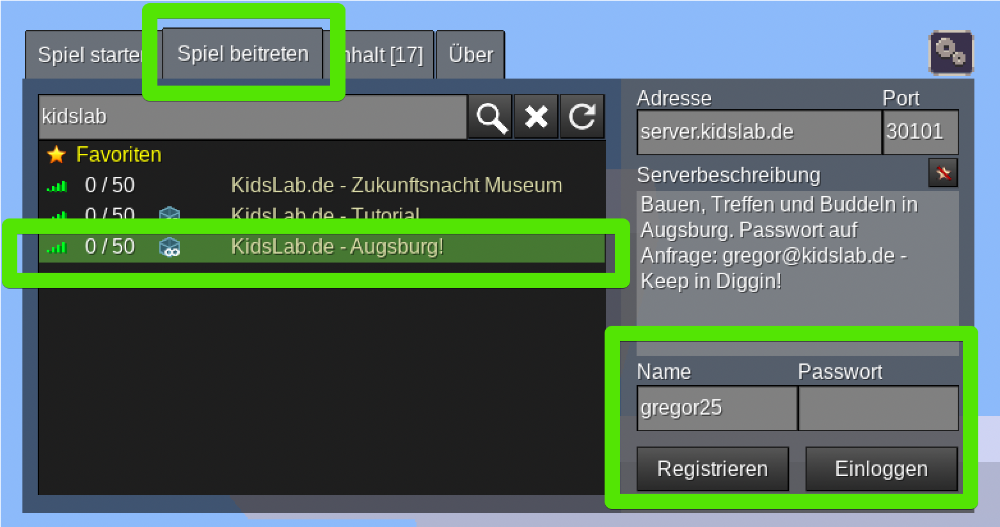

We've "rebuilt" Augsburg in Minetest - with all its streets and buildings. You can help build it!

**Step 1:**

- 
step: Open Minetest- 
step: 'Go to the **Join Game** tab'- 
step: 'Type **kidslab** into the search field!'
image:
- 
- 
step: 'The password is **kidslab**'- 
step: 'Click on **log in**'- 
step: You're in the world!

## Controls

| Action                     | Keys           | Note                  |
| -------------------------- | ---------------- | -------------------------- |
| Move                    | W / A / S / D    | Forward, backward, etc.  |
| Jump                   | Space bar        |                            |
| Dig                      | Left mouse button  |                            |
| Build                      | Right mouse button |                            |
| Select active item | 1,2,3,4 ...      | or: mouse wheel             |
| Inventory                   | I                | different from Minecraft!  |
| Fly                    | K                | Double-tapping space also works |
| Fast flying            | J                | On / off                   |

## Where to go?

When you enter the world, you're standing in front of 2 phone booths — you can teleport from there to important places in Augsburg

## 🎮 Our server rules

#### 👥 Getting along

* Be friendly to all other players
* Help new players and explain the rules to them
* No insults or bullying
* Say in chat what you'd like to be called

#### 🏠 Building and playing

* Always ask before changing anything on other people's builds
* Respect the boundaries of other players' plots and areas
* Don't build directly next to others without asking
* Griefing (deliberate destruction) is not allowed
