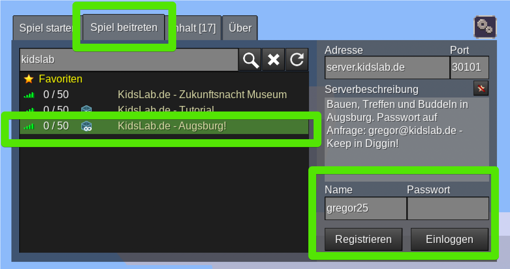

Wir haben Augsburg in Minetest "nachgebaut" - mit allen Straßen und Gebäuden. Du kannst mitbauen!

**Schritt 1:**

- 
step: Öffne Minetest- 
step: 'Gehe auf den Reiter **Spiel beitreten**'- 
step: 'Gib **kidslab** im Suchfeld ein!'
image:
- 
- 
step: 'Passwort ist **kidslab**'- 
step: 'Klicke auf **einloggen**'- 
step: Du bist in der Welt!

## Bedienung

| Aktion                     | Tasten           | Bemerkung                  |
| -------------------------- | ---------------- | -------------------------- |
| Bewegen                    | W / A / S / D    | Vorwärts, Rückwärts, etc.  |
| Springen                   | Leertaste        |                            |
| Abbauen                    | Linke Maustaste  |                            |
| Bauen                      | Rechte Maustaste |                            |
| Auswahl aktiver Gegenstand | 1,2,3,4 ...      | oder: Maus-Rad             |
| Inventar                   | I                | anders als bei Minecraft!  |
| Fliegen                    | K                | Doppel-Leertaste geht auch |
| Schnell-Fliegen            | J                | An / Aus                   |

## Wo gehts lang?

Wenn du in die Welt kommst, stehts du vor 2 Telefonzellen - da kannst du dich zu wichtigen Orten in Augsburg teleportieren lassen

## 🎮 Unsere Server-Regeln

#### 👥 Miteinander

* Sei freundlich zu allen anderen Spielern
* Hilf neuen Spielern und erkläre ihnen gerne die Regeln
* Keine Beleidigungen oder Mobbing
* Schreibe im Chat, wie du selbst angeschrieben werden möchtest

#### 🏠 Bauen und Spielen

* Frag immer, bevor du an den Bauwerken anderer etwas veränderst
* Respektiere die Grenzen von Grundstücken und Gebieten anderer Spieler
* Baue nicht direkt neben anderen, ohne zu fragen
* Griefen (absichtliches Zerstören) ist nicht erlaubt
