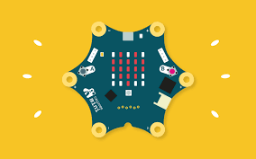

Discover the world of **microcontrollers** with the Calliope mini! This little star-shaped computer fits in your hand and can do an incredible amount: light up LEDs, play music, measure temperature, and much more. And the coolest part: **you** tell it what to do!



## What is the Calliope mini?

The Calliope mini is a **small computer** developed especially for kids and teenagers — right here in Germany! It's shaped like a star and comes with everything you need to program:

- **25 red LEDs** (a 5x5 grid) — for displaying images and text
- **One RGB LED** — that lights up in any colour
- **Two buttons** (A and B) — like buttons to press
- **A speaker** — for sounds and music
- **Sensors** — for light, temperature, motion, and compass
- **Connectors** (pins) — for hooking up external things, like a motor

## What you need

- A **Calliope mini** (available at KidsLab!)
- A **USB cable** (Micro-USB)
- A **computer or laptop** with internet access

## Step 1: Connecting Calliope to your computer

1. Connect the Calliope mini to your computer with the **USB cable**
2. The Calliope now appears as a **USB drive** (like a USB stick)
3. Open **[makecode.calliope.cc](https://makecode.calliope.cc)** in your browser
4. Click **"New Project"**

## Step 2: Your first program — a smiley!

Let's dive right in and display a smiley on the LEDs:

1. In the middle you'll see two blocks: **"on start"** and **"forever"**
2. Click **"Basic"** on the left
3. Drag the **"show LEDs"** block into the **"on start"** block
4. Click the little squares in the LED block to draw a smiley pattern:
   ```
   . # . # .
   . # . # .
   . . . . .
   # . . . #
   . # # # .
   ```
5. Click **"Download"** at the bottom left
6. Drag the downloaded file onto the Calliope drive
7. The Calliope blinks briefly — and shows your smiley!

## Step 3: Reacting to button presses

Now let's make it more interactive! Your Calliope should react to buttons:

1. Click on **"Input"**
2. Drag the **"on button A pressed"** block onto the workspace
3. Add inside it: **"show string"** → type in e.g. **"Hi!"**
4. Do the same for **button B** with a different text
5. Upload the program to the Calliope

Now press button A or B — your Calliope shows the text scrolling across the LEDs!

## Step 4: Colours with the RGB LED

The Calliope also has a **coloured LED** that can light up in any colour:

1. Click **"Basic"** → **"more"**
2. Drag the **"set LED colour to"** block into **"on start"**
3. Choose a colour — red, green, blue, or mix your own!
4. Upload the program and watch the Calliope light up


**Challenge:** Can you program the Calliope as a traffic light? Red → yellow → green with pauses in between!


## Step 5: Making music!

Your Calliope has a built-in speaker:

1. Click on **"Music"**
2. Drag the **"play tone"** block into your program
3. Choose a note (e.g. Middle C) and the duration
4. Chain several notes together — and you've got a melody!

Try to see if you can play the tune of "Twinkle Twinkle Little Star"!

## Ideas to keep going

- **Dice:** on shake (Input → "on shake") show a random number from 1–6
- **Thermometer:** read the temperature sensor and display the degrees
- **Compass:** show the direction on the LEDs
- **Reaction game:** who can press the button faster when the LED lights up?


**At KidsLab** we have Calliope minis to try out! Come by and program your own mini computer.

