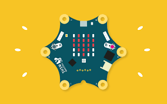

Entdecke die Welt der **Mikrocontroller** mit dem Calliope mini! Dieser kleine sternförmige Computer passt in deine Hand und kann unglaublich viel: LEDs leuchten lassen, Musik abspielen, die Temperatur messen und noch viel mehr. Und das Coolste: **Du** sagst ihm, was er tun soll!



## Was ist der Calliope mini?

Der Calliope mini ist ein **kleiner Computer**, der extra für Kinder und Jugendliche entwickelt wurde — hier in Deutschland! Er hat die Form eines Sterns und bringt alles mit, was du zum Programmieren brauchst:

- **25 rote LEDs** (ein 5x5-Raster) — damit kannst du Bilder und Text anzeigen
- **Eine RGB-LED** — die leuchtet in allen Farben
- **Zwei Taster** (A und B) — wie Knöpfe zum Drücken
- **Einen Lautsprecher** — für Töne und Musik
- **Sensoren** — für Licht, Temperatur, Bewegung und Kompass
- **Anschlüsse** (Pins) — um externe Sachen anzuschließen, z.B. einen Motor

## Was du brauchst

- Einen **Calliope mini** (gibt es bei uns im KidsLab!)
- Ein **USB-Kabel** (Micro-USB)
- Einen **Computer oder Laptop** mit Internetzugang

## Schritt 1: Calliope mit dem Computer verbinden

1. Verbinde den Calliope mini mit dem **USB-Kabel** an deinen Computer
2. Der Calliope erscheint jetzt als **USB-Laufwerk** (wie ein USB-Stick)
3. Öffne im Browser die Seite **[makecode.calliope.cc](https://makecode.calliope.cc)**
4. Klicke auf **"Neues Projekt"**

## Schritt 2: Dein erstes Programm — ein Smiley!

Lass uns direkt loslegen und ein Smiley auf den LEDs anzeigen:

1. In der Mitte siehst du zwei Blöcke: **"beim Start"** und **"dauerhaft"**
2. Klicke links auf **"Grundlagen"**
3. Ziehe den Block **"zeige LEDs"** in den Block **"beim Start"**
4. Klicke auf die kleinen Kästchen im LED-Block, um ein Smiley-Muster zu malen:
   ```
   . # . # .
   . # . # .
   . . . . .
   # . . . #
   . # # # .
   ```
5. Klicke unten links auf **"Herunterladen"**
6. Ziehe die heruntergeladene Datei auf das Calliope-Laufwerk
7. Der Calliope blinkt kurz — und zeigt dein Smiley!

## Schritt 3: Auf Knopfdruck reagieren

Jetzt machen wir es interaktiver! Dein Calliope soll auf Knöpfe reagieren:

1. Klicke auf **"Eingabe"**
2. Ziehe den Block **"wenn Knopf A gedrückt"** auf die Arbeitsfläche
3. Füge dort hinein: **"zeige Text"** → tippe z.B. **"Hi!"** ein
4. Mache das Gleiche für **Knopf B** mit einem anderen Text
5. Lade das Programm auf den Calliope

Drücke jetzt Knopf A oder B — dein Calliope zeigt den Text als Laufschrift auf den LEDs!

## Schritt 4: Farben mit der RGB-LED

Der Calliope hat auch eine **bunte LED**, die in jeder Farbe leuchten kann:

1. Klicke auf **"Grundlagen"** → **"mehr"**
2. Ziehe den Block **"setze LED-Farbe auf"** in **"beim Start"**
3. Wähle eine Farbe aus — rot, grün, blau oder mische deine eigene!
4. Lade das Programm hoch und schau, wie der Calliope leuchtet


**Challenge:** Kannst du den Calliope als Ampel programmieren? Rot → Gelb → Grün mit Pausen dazwischen!


## Schritt 5: Musik machen!

Dein Calliope hat einen eingebauten Lautsprecher:

1. Klicke auf **"Musik"**
2. Ziehe den Block **"spiele Note"** in dein Programm
3. Wähle eine Note (z.B. Mittleres C) und die Dauer
4. Setze mehrere Noten hintereinander — und du hast eine Melodie!

Probier mal, ob du die Melodie von "Alle meine Entchen" hinbekommst!

## Ideen zum Weitermachen

- **Würfel:** Bei Schütteln (Eingabe → "wenn geschüttelt") eine zufällige Zahl von 1-6 anzeigen
- **Thermometer:** Den Temperatursensor auslesen und die Gradzahl anzeigen
- **Kompass:** Die Himmelsrichtung auf den LEDs anzeigen
- **Reaktionsspiel:** Wer drückt schneller auf den Knopf, wenn die LED aufleuchtet?


**Im KidsLab** haben wir Calliope minis zum Ausprobieren! Komm vorbei und programmiere deinen eigenen Minicomputer.

