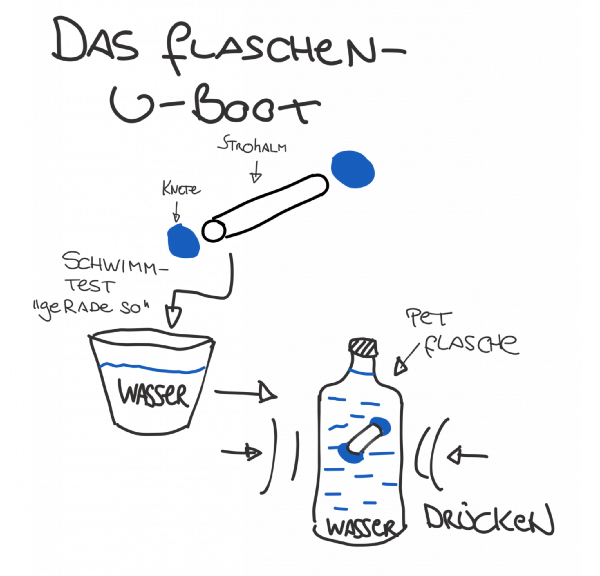

With this little experiment, you'll build a working submarine that behaves just like a real one! By applying pressure, you can make it dive and surface.

**Step 1:**

- 
step: 'Prepare the straw - seal both ends well with modelling clay'- 
step: 'Test the submarine in a glass of water - it should just barely float'- 
step: >
If you push it under water, it should
slowly float back up- 
step: >
If it rises too fast, add
more clay- 
step: >
If it sinks, remove a little
clay- 
step: >
Put the perfectly adjusted submarine into
the PET bottle- 
step: >
Fill the bottle completely with water (to
the brim)- 
step: 'Screw the lid on tight - there must be no air bubbles inside'- 
step: >
Now squeeze the bottle
from the sides- 
step: >
The submarine dives! Let go and it
floats back up

**How does this work?**

Just like in a real submarine, the air pocket inside your boat gets compressed when you squeeze the bottle. That gives the boat less volume but the same weight — density increases! When the density gets higher than that of water, the submarine sinks.

When you let go, the air expands again, the volume increases, the density drops, and the submarine rises.

**This is exactly what happens in real submarines:** they fill special tanks with water to dive, and pump the water back out to surface!

:-)
