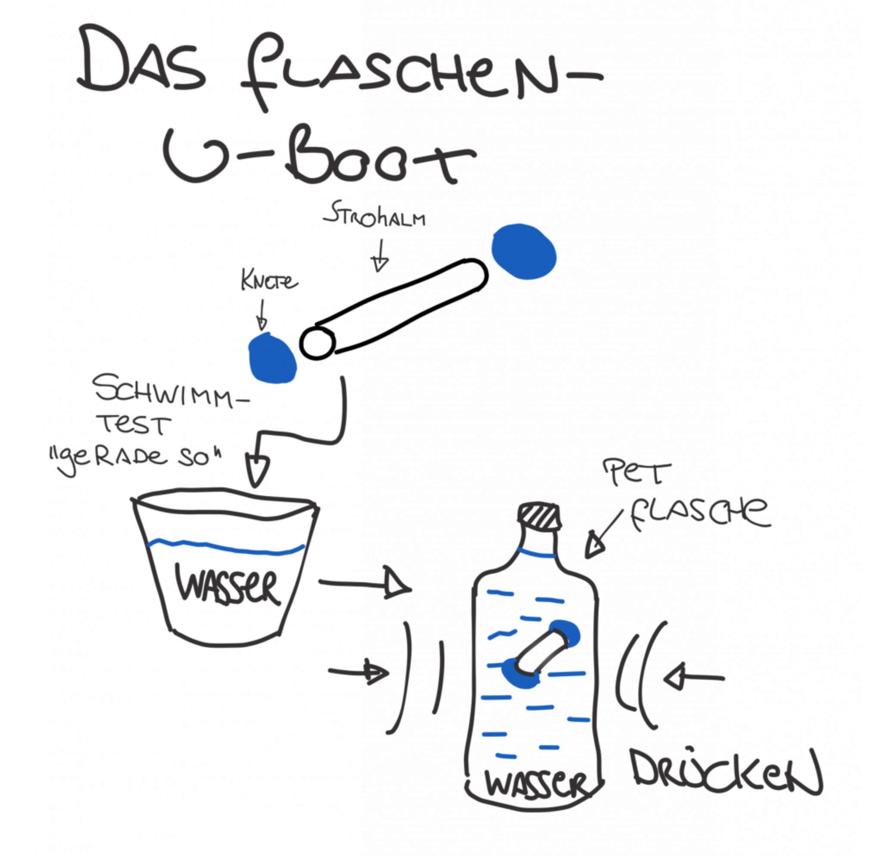

Mit diesem kleinen Experiment baust du ein funktionierendes U-Boot, das genauso funktioniert wie ein echtes! Durch Druck kannst du es zum Tauchen und Auftauchen bringen.

**Schritt 1:**

- 
step: 'Strohhalm vorbereiten - beide Enden mit Knete gut verschließen'- 
step: 'U-Boot im Wasserglas testen - es sollte gerade noch schwimmen'- 
step: >
Wenn du es unter Wasser drückst, muss
es langsam wieder auftauchen- 
step: >
Falls es zu schnell aufsteigt, mehr
Knete hinzufügen- 
step: >
Falls es untergeht, etwas Knete
entfernen- 
step: >
Das perfekt eingestellte U-Boot in die
PET-Flasche geben- 
step: >
Flasche komplett mit Wasser füllen (bis
zum Rand)- 
step: 'Deckel fest aufschrauben - keine Luftblasen dürfen drin sein'- 
step: >
Jetzt die Flasche seitlich
zusammendrücken- 
step: >
Das U-Boot taucht ab! Loslassen und es
steigt wieder auf

**Wie funktioniert das?**

Genau wie bei einem echten U-Boot wird der Luft-Teil deines Bootes beim Zusammendrücken der Flasche komprimiert. Das Boot hat dadurch weniger Volumen, aber das gleiche Gewicht - die Dichte steigt! Wenn die Dichte höher wird als die von Wasser, sinkt das U-Boot ab.

Beim Loslassen expandiert die Luft wieder, das Volumen wird größer, die Dichte sinkt und das U-Boot steigt auf.

**Das passiert auch bei echten U-Booten:** Sie füllen spezielle Tanks mit Wasser zum Abtauchen und pumpen das Wasser wieder raus zum Auftauchen!

:-)
