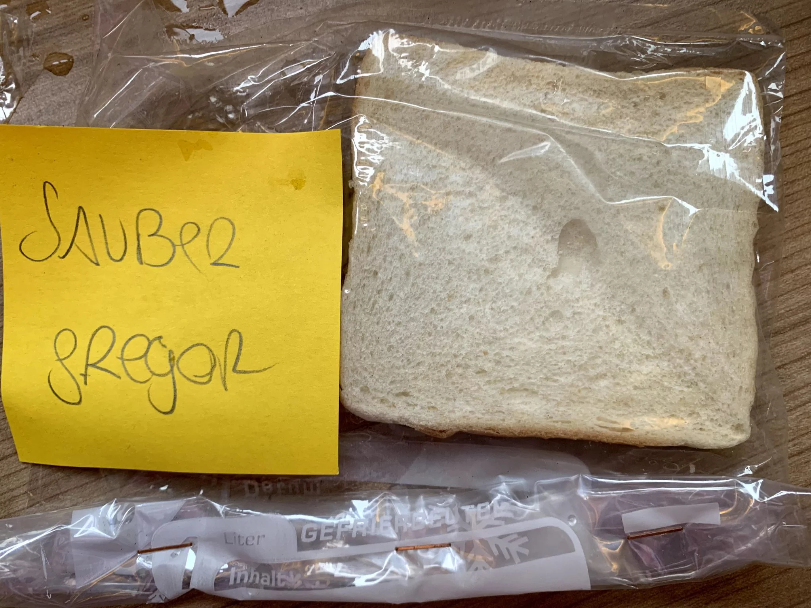
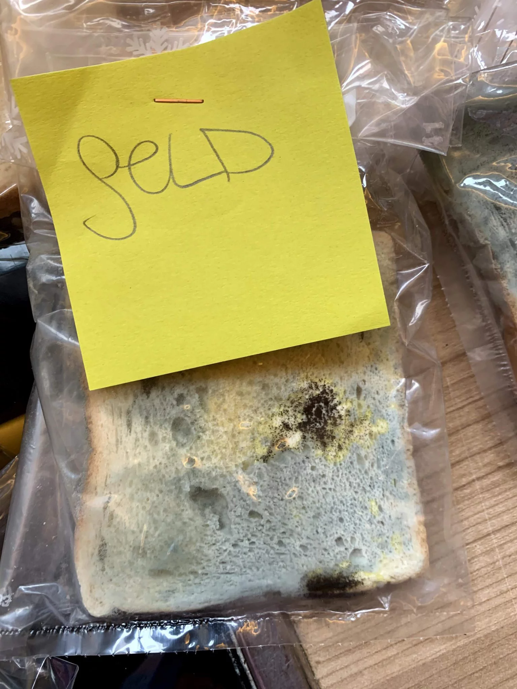
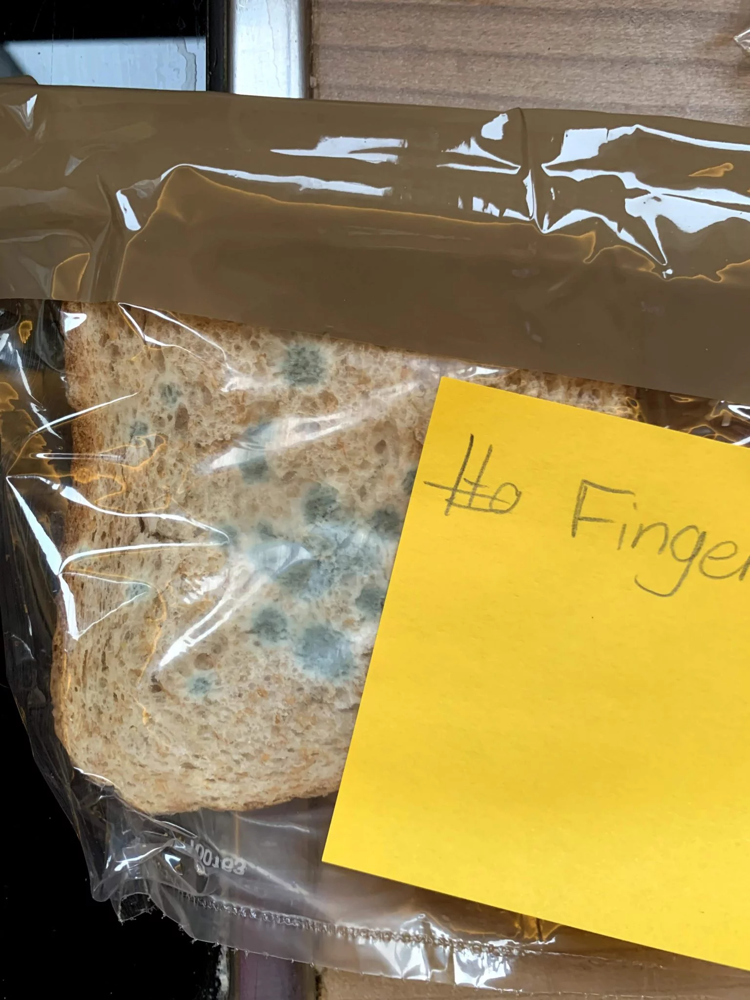

Parents always say "wash your hands, there are bacteria on them" – but is that actually true? As part of a simple experiment from our "Invisible World" course, we tried to find out whether these invisible germs really exist — whether we could make them visible!

As a growth medium for the germs, we used plain toast bread! It was taken fresh out of the packet and then contaminated with various germ sources. Into a freezer bag, sealed airtight, and placed somewhere warm so the bacteria and fungi would feel right at home.

**Step 1:**

**Preparation (5 minutes)**

Prepare your workspace: get all materials ready
Wash your hands: wash your hands thoroughly - important for the first slice!
Label the bags:

Bag 1: "Clean hands"
Bag 2: "Dirty hands"
Bag 3: "Kitchen sponge"
Bag 4: "Money/coins"

**Step 2:**

**Procedure (10 minutes)**

- Control sample: take the first slice of bread only with freshly washed hands and put it in bag 1
- Dirty hands: touch the second slice of bread with unwashed, dirty hands → bag 2
- Kitchen sponge: dab the third slice of bread with a used kitchen sponge → bag 3
- Money: rub the fourth slice of bread with banknotes or coins → bag 4

**Step 3:**

**Observation (over 2 weeks)**
- Seal airtight: close all bags tightly
- Warm spot: place all bags somewhere warm (near a radiator, a warm windowsill)
- Check daily: look for changes every day
- Be patient: nothing happens after a week - but after 2 weeks, clear differences show up!- 
step: '**What happens?** The clean bread stays fresh for a long time, while various bacteria and mould grow on the other slices - proof that invisible germs are lurking everywhere!'

## Results after 2 weeks

Here's what our toast slices looked like after the experiment:

