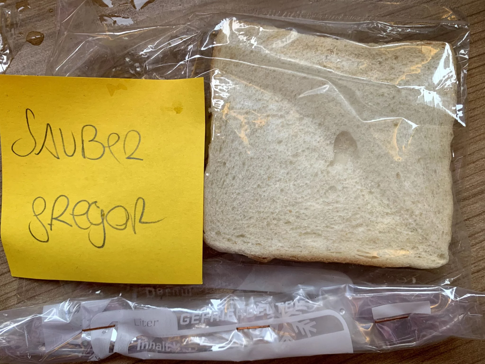
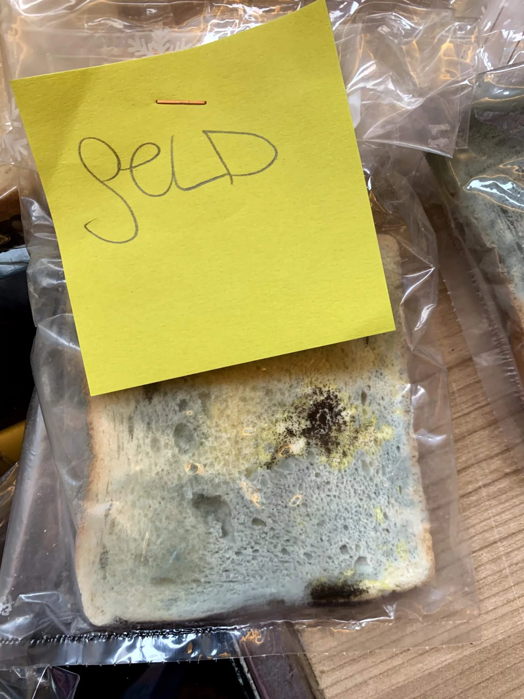
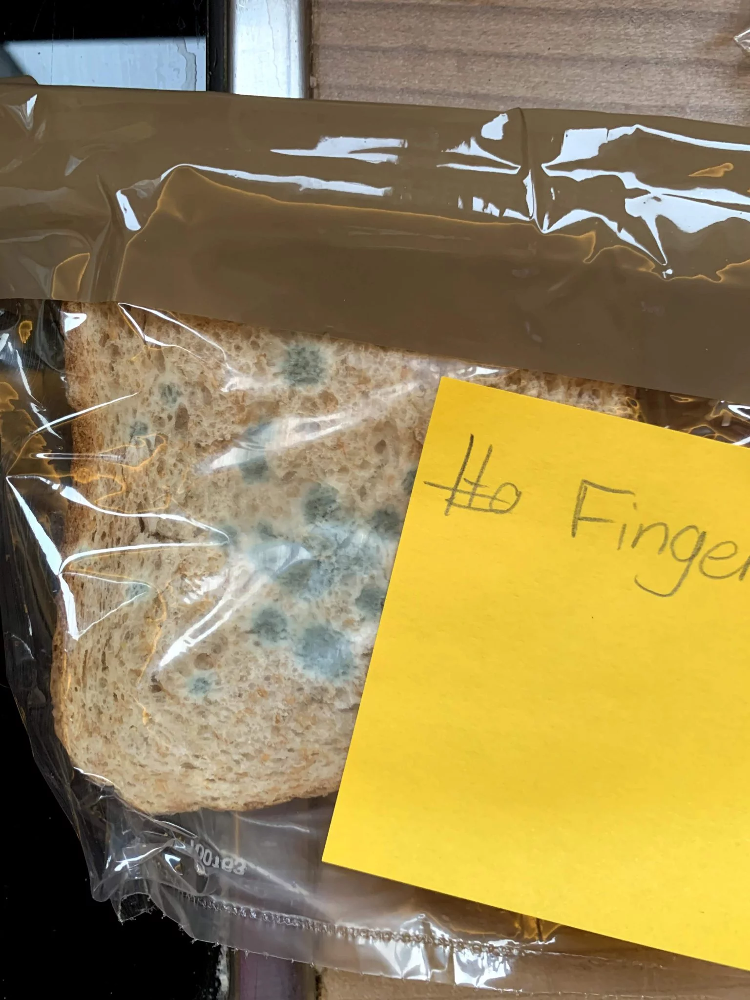

Eltern sagen ja immer „Wasch deine Hände, da sind Bakterien dran“ – aber stimmt das denn auch wirklich? Im Rahmen eines einfachen Versuches aus dem Kurs „Unsichtbares“ haben wir das mal ausprobiert, ob es diese unsichtbaren Krankmacher auch wirklich gibt – ob wir das sichtbar machen können!

Als Grundlage für das Wachstum der Keime haben wir einfaches Toast-Brot genommen! Das wurde frisch aus der Packung genommen und dann eben mit den verschiedenen Keim-Quellen kontaminiert. Ab in einen Gefrierbeutel, luftdicht verschlossen und an einen warmen Platz, damit sich die Bakterien und Pilze auch richtig wohl fühlen.

**Schritt 1:**

**Vorbereitung (5 Minuten)**

Arbeitsplatz vorbereiten: Stelle alle Materialien bereit
Hände waschen: Wasche dir gründlich die Hände - das ist wichtig für das erste Brot!
Beutel beschriften:

Beutel 1: "Saubere Hände"
Beutel 2: "Schmutzige Hände"
Beutel 3: "Küchenschwamm"
Beutel 4: "Geld/Münzen"

**Schritt 2:**

**Durchführung (10 Minuten)**

- Kontroll-Probe: Nimm die erste Brotscheibe nur mit frisch gewaschenen Händen und stecke sie in Beutel 1
- Schmutzige Hände: Fasse die zweite Brotscheibe mit ungewaschenen, schmutzigen Händen an → Beutel 2
- Küchenschwamm: Tupfe die dritte Brotscheibe mit einem gebrauchten Küchenschwamm ab → Beutel 3
- Geld: Reibe die vierte Brotscheibe mit Geldscheinen oder Münzen ab → Beutel 4

**Schritt 3:**

**Beobachtung (2 Wochen lang)**
- Luftdicht verschließen: Alle Beutel fest verschließen
- Warmer Platz: Alle Beutel an einen warmen Ort legen (Heizung, warme Fensterbank)
- Täglich kontrollieren: Schau jeden Tag nach Veränderungen
- Geduld haben: Nach einer Woche passiert noch nichts - aber nach 2 Wochen zeigen sich deutliche Unterschiede!- 
step: '**Was passiert?** Das saubere Brot bleibt lange frisch, während auf den anderen Broten verschiedene Bakterien und Schimmelpilze wachsen - der Beweis, dass überall unsichtbare Keime lauern!'

## Ergebnisse nach 2 Wochen

So sahen unsere Toast-Brote nach dem Experiment aus:

