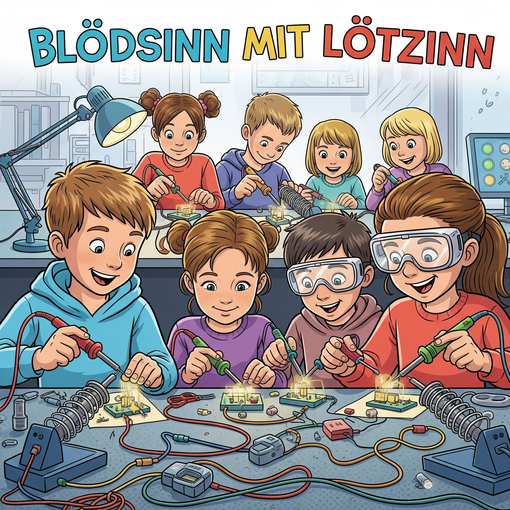

Löten ist wie Kleben mit Metall — nur viel cooler! Mit einem Lötkolben und etwas Lötzinn kannst du elektronische Bauteile miteinander verbinden und deine eigenen Schaltungen bauen. Klingt kompliziert? Ist es gar nicht! Hier lernst du die Grundlagen.

## Was ist Löten überhaupt?

Beim Löten erhitzt du ein Metall namens **Lötzinn** mit einem **Lötkolben**, bis es schmilzt. Das flüssige Zinn fließt zwischen zwei Metallteile und verbindet sie, wenn es wieder fest wird. So entstehen elektrische Verbindungen — zum Beispiel auf einer Platine.

## Was du brauchst

- **Lötkolben** (am besten eine Lötstation mit Temperaturregler)
- **Lötzinn** (dünner Draht auf einer Rolle)
- **Lötkolbenhalter** (damit der heiße Kolben sicher steht)
- **Schwamm oder Messingwolle** (zum Reinigen der Lötspitze)
- **Platine oder Übungsplatine** (zum Üben)
- **Bauteile** zum Einlöten (z.B. LEDs, Widerstände)

## Sicherheit geht vor!


**Wichtig:** Ein Lötkolben wird über 300 Grad heiß! Beachte diese Regeln:
- **Nie** die Spitze des Lötkolbens anfassen
- Den Lötkolben immer in den **Halter** zurücklegen
- In einem **gut belüfteten** Raum arbeiten (Lötdämpfe nicht einatmen)
- **Schutzbrille** tragen
- **Immer einen Erwachsenen** dabei haben


## Schritt 1: Lötkolben vorbereiten

1. Stecke den Lötkolben ein und warte, bis er heiß ist (ca. 2-3 Minuten)
2. Stelle die Temperatur auf ca. **320-350 Grad** ein
3. Reinige die Spitze am feuchten Schwamm oder der Messingwolle
4. **Verzinne die Spitze:** Halte etwas Lötzinn an die Spitze, bis sie silbrig glänzt — das nennt man „Verzinnen"

## Schritt 2: Bauteil einsetzen

1. Stecke dein Bauteil (z.B. einen Widerstand) durch die Löcher in der Platine
2. Biege die Beinchen auf der Rückseite leicht auseinander, damit das Bauteil nicht herausfällt
3. Drehe die Platine um — du lötest immer auf der **Rückseite**

## Schritt 3: Deine erste Lötstelle

Jetzt wird es ernst! So setzt du eine saubere Lötstelle:

1. **Lötkolben an die Lötstelle halten:** Berühre gleichzeitig das Beinchen des Bauteils und die Kupferfläche auf der Platine mit der Lötkolbenspitze
2. **Kurz warten** (ca. 2-3 Sekunden) — damit sich beides aufheizt
3. **Lötzinn dazugeben:** Halte den Lötzinndraht an die Stelle (nicht an den Lötkolben!). Das Zinn sollte von alleine in die Lötstelle fließen
4. **Lötzinn wegnehmen**, dann **Lötkolben wegnehmen**
5. **Nicht bewegen!** Lass die Lötstelle in Ruhe abkühlen


**Tipp:** Die ganze Aktion sollte nur **3-5 Sekunden** dauern. Wenn du zu lange heizt, kannst du das Bauteil kaputt machen!


## Wie sieht eine gute Lötstelle aus?

| Gute Lötstelle | Schlechte Lötstelle |
|---|---|
| Glänzend und silbrig | Matt und grau |
| Kegelförmig (wie ein kleiner Vulkan) | Kugelförmig (zu viel Zinn) |
| Glatt | Rissig oder bröckelig |

## Schritt 4: Überstehende Beinchen abschneiden

Wenn deine Lötstelle gut aussieht, schneide das überstehende Beinchen mit einem **Seitenschneider** kurz über der Lötstelle ab. Vorsicht: Das abgeschnittene Stück kann wegfliegen — Schutzbrille nicht vergessen!

## Typische Fehler und wie du sie vermeidest

- **Kalte Lötstelle** (matt, rissig): Du hast zu kurz oder nicht heiß genug gelötet. Nochmal aufheizen und etwas Zinn dazugeben.
- **Lötbrücke** (zwei Lötstellen sind verbunden): Zu viel Lötzinn! Mit dem Lötkolben das überschüssige Zinn aufnehmen.
- **Bauteil bewegt sich**: Beinchen vorher besser fixieren oder mit Klebeband festhalten.

## Geschafft!

Du hast deine ersten Lötstellen gesetzt — Gratulation! Löten ist wie Fahrradfahren: Am Anfang wackelt es etwas, aber mit etwas Übung wird es immer besser. Probier doch als nächstes ein kleines Projekt aus, zum Beispiel eine blinkende LED-Schaltung!


**Nächster Schritt:** Schau dir unsere weiteren Elektronik-Projekte an und baue deine erste eigene Schaltung!

