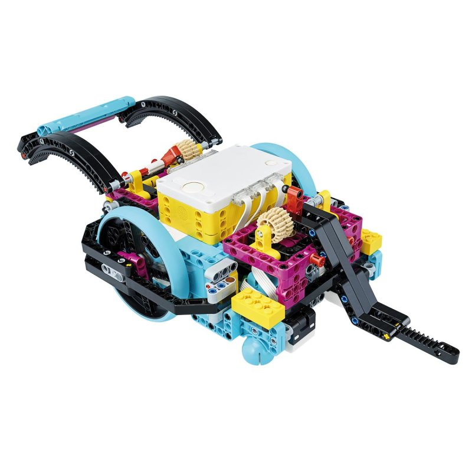

Do you love LEGO? Then you'll love **LEGO Spike Prime**! Because with it, you don't just build cool models — you bring them to life. Your robot can drive, grab things, and even react to obstacles. And best of all: you tell it what to do!



## What is LEGO Spike Prime?

LEGO Spike Prime is a robotics set from LEGO Education. It consists of:

- **LEGO bricks** — you already know these! Though these are Technic parts with holes and axles
- **A hub** — this is your robot's brain (the yellow box with the display)
- **Motors** — these let your robot move
- **Sensors** — these let your robot sense its surroundings (measure distance, recognise colours, feel touch)

## What you need

- A **LEGO Spike Prime set** (available at KidsLab!)
- A **tablet or laptop** with the LEGO Education Spike app
- **Some space** on the table

## Step 1: Get to know the set

Open the box and look at the parts:

- **The hub (yellow):** this is the heart of it all. It has a small screen, buttons, and ports for motors and sensors
- **Motors (medium and large):** these move your robot
- **Sensors:** the distance sensor (the "eyes"), the colour sensor, and the force sensor
- **Cables:** you use these to connect motors and sensors to the hub
- **LEGO parts:** beams, gears, wheels, and much more


**Tip:** best to sort the parts into the box's compartments, so you can quickly find what you need!


## Step 2: Turn on the hub

1. Press the **big button** in the middle of the hub
2. The hub shows a smiley on the display — it's ready!
3. Open the **LEGO Spike App** on your tablet
4. Connect the hub via **Bluetooth** to the tablet (the app shows you how)

## Step 3: Build your first model

Let's start simple! Build a small vehicle:

1. Attach **two motors** to the hub — one on the left, one on the right
2. Attach a **wheel** to each motor's axle
3. Build a **support wheel** (or a skid) at the front so your vehicle doesn't tip over
4. Connect the motors to the hub with **cables** (Port A and Port B)

By the way, the app has great step-by-step building instructions — just follow the pictures!

## Step 4: Your first program

Now it gets exciting — you're telling your robot what to do!

1. Open a **new project** in the app
2. You'll see colourful **programming blocks** (similar to Scratch)
3. Drag the **"move forward"** block into your program
4. Set how far your robot should drive
5. Press **Play** — and off it goes!

Try out these commands:
- **Drive forward** — your robot drives straight ahead
- **Drive backward** — your robot drives back
- **Turn** — your robot turns
- **Wait** — your robot pauses

## Step 5: Try out sensors

Now attach the **distance sensor** to the front of your vehicle and connect it to the hub.

Now you can program this:
```
If distance < 15 cm
  → Stop!
  → Turn left
  → Keep driving
```

Your robot now avoids obstacles! How cool is that?

## Ideas to keep going

There's so much you can do with LEGO Spike! Here are a few ideas:

- **Build a claw arm:** a robot that can pick up objects
- **Colour sorter:** the robot recognises colours and sorts LEGO bricks
- **Dance mode:** program a cool dance routine with different movements
- **Course driver:** your robot drives through an obstacle course


**At KidsLab** we have LEGO Spike sets to try out! Come by and build your own robot.

