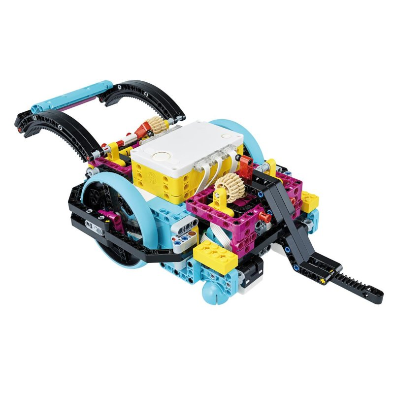

Du magst LEGO? Dann wirst du **LEGO Spike Prime** lieben! Denn damit baust du nicht einfach nur coole Modelle — du bringst sie auch zum Leben. Dein Roboter kann fahren, Sachen greifen und sogar auf Hindernisse reagieren. Und das Beste: Du sagst ihm, was er tun soll!



## Was ist LEGO Spike Prime?

LEGO Spike Prime ist ein Robotik-Set von LEGO Education. Es besteht aus:

- **LEGO-Bausteinen** — die kennst du schon! Allerdings sind es Technik-Teile mit Löchern und Achsen
- **Einem Hub** — das ist das Gehirn deines Roboters (der gelbe Kasten mit dem Display)
- **Motoren** — damit kann sich dein Roboter bewegen
- **Sensoren** — damit kann dein Roboter seine Umgebung wahrnehmen (Abstand messen, Farben erkennen, Berührung spüren)

## Was du brauchst

- Ein **LEGO Spike Prime Set** (gibt es bei uns im KidsLab!)
- Ein **Tablet oder Laptop** mit der LEGO Education Spike App
- **Etwas Platz** auf dem Tisch

## Schritt 1: Das Set kennenlernen

Öffne den Kasten und schau dir die Teile an:

- **Der Hub (gelb):** Das ist das Herzstück. Er hat einen kleinen Bildschirm, Tasten und Anschlüsse für Motoren und Sensoren
- **Motoren (mittel und groß):** Die bewegen deinen Roboter
- **Sensoren:** Der Abstandssensor (die "Augen"), der Farbsensor und der Drucksensor
- **Kabel:** Damit verbindest du Motoren und Sensoren mit dem Hub
- **LEGO-Teile:** Balken, Zahnräder, Räder und vieles mehr


**Tipp:** Sortiere die Teile am besten in die Fächer des Kastens, damit du schnell findest, was du brauchst!


## Schritt 2: Den Hub einschalten

1. Drücke den **großen Knopf** in der Mitte des Hubs
2. Der Hub zeigt ein Smiley auf dem Display — er ist bereit!
3. Öffne die **LEGO Spike App** auf deinem Tablet
4. Verbinde den Hub per **Bluetooth** mit dem Tablet (die App zeigt dir wie)

## Schritt 3: Dein erstes Modell bauen

Fangen wir einfach an! Baue ein kleines Fahrzeug:

1. Befestige **zwei Motoren** am Hub — einen links, einen rechts
2. Stecke je ein **Rad** auf die Motorachsen
3. Baue ein **Stützrad** (oder eine Kufe) vorne dran, damit dein Fahrzeug nicht umkippt
4. Verbinde die Motoren mit **Kabeln** am Hub (Port A und Port B)

Die App hat übrigens super Bauanleitungen — folge einfach den Bildern Schritt für Schritt!

## Schritt 4: Dein erstes Programm

Jetzt wird es spannend — du sagst deinem Roboter, was er tun soll!

1. Öffne in der App einen **neuen Projekt**
2. Du siehst bunte **Programmierblöcke** (ähnlich wie bei Scratch)
3. Ziehe den Block **"Fahre vorwärts"** in dein Programm
4. Stelle ein, wie weit dein Roboter fahren soll
5. Drücke auf **Play** — und los geht's!

Probiere mal diese Befehle aus:
- **Vorwärts fahren** — dein Roboter fährt geradeaus
- **Rückwärts fahren** — dein Roboter fährt zurück
- **Drehen** — dein Roboter dreht sich
- **Warten** — dein Roboter macht eine Pause

## Schritt 5: Sensoren ausprobieren

Baue jetzt den **Abstandssensor** vorne an dein Fahrzeug und verbinde ihn mit dem Hub.

Jetzt kannst du programmieren:
```
Wenn Abstand < 15 cm
  → Stopp!
  → Drehe links
  → Fahre weiter
```

Dein Roboter weicht jetzt Hindernissen aus! Wie cool ist das denn?

## Ideen zum Weitermachen

Du kannst so viel mit LEGO Spike machen! Hier ein paar Ideen:

- **Greifarm bauen:** Ein Roboter, der Gegenstände aufheben kann
- **Farbsortierer:** Der Roboter erkennt Farben und sortiert LEGO-Steine
- **Tanzmodus:** Programmiere eine coole Tanzroutine mit verschiedenen Bewegungen
- **Parcours-Fahrer:** Dein Roboter fährt einen Hindernisparcours ab


**Im KidsLab** haben wir LEGO Spike Sets zum Ausprobieren! Komm vorbei und baue deinen eigenen Roboter.

