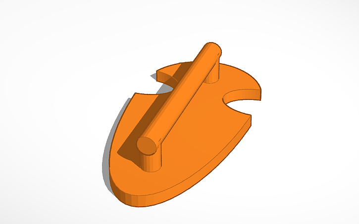
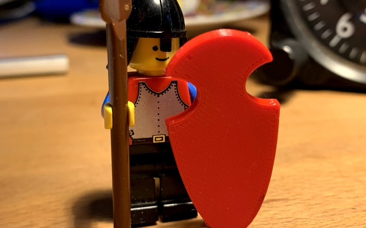

Create your own Lego accessories and add-ons with **TinkerCAD**! Design cool extensions for your Lego sets and learn **3D design** along the way. Your creative ideas are then brought to life on the 3D printer.

**Step 1:**

- 
step: 'Think of something - what's missing from your Lego collection?'- 
step: Measure it precisely with calipers!- 
step: >
Or alternatively, use this design as a
template
image:
- 
- 
step: Adjust it!- 
step: >
Done! Then send it straight to the 3D
printer!

