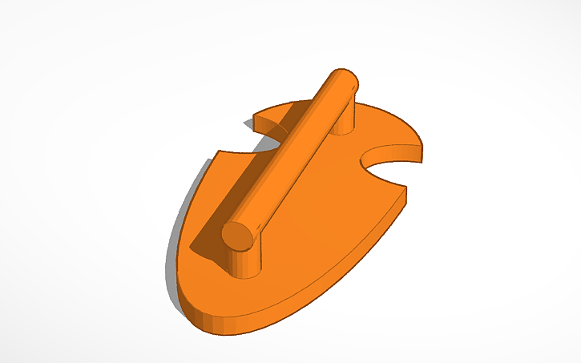

Erstelle mit **TinkerCAD** eigene Lego-Accessoires und Zubehörteile! Entwerfe coole Erweiterungen für deine Lego-Sets und lerne dabei **3D-Design**. Deine kreativen Ideen werden anschließend am 3D-Drucker zum Leben erweckt.

**Schritt 1:**

- 
step: 'Denk dir was aus - was fehlt dir in Lego?'- 
step: Miss es mit der Schieblehre genau aus!- 
step: >
Alternativ nimm dieses Design als
Vorlage
image:
- 
- 
step: Pass es an!- 
step: >
Fertig! Dann gleich auf den 3D-Drucker
damit!

