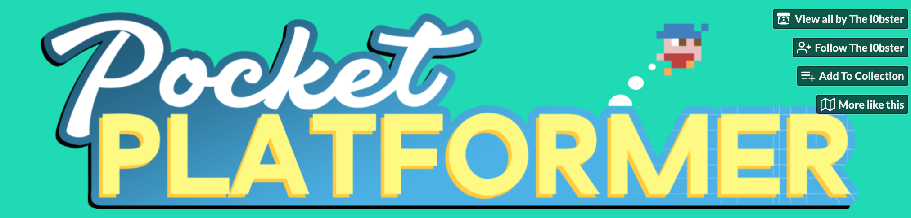
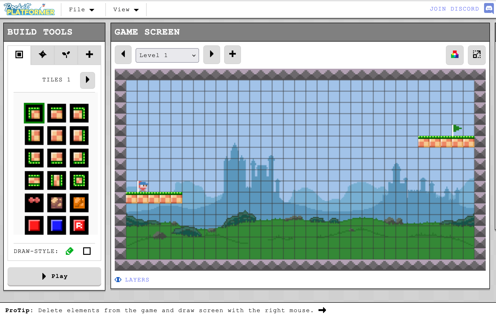
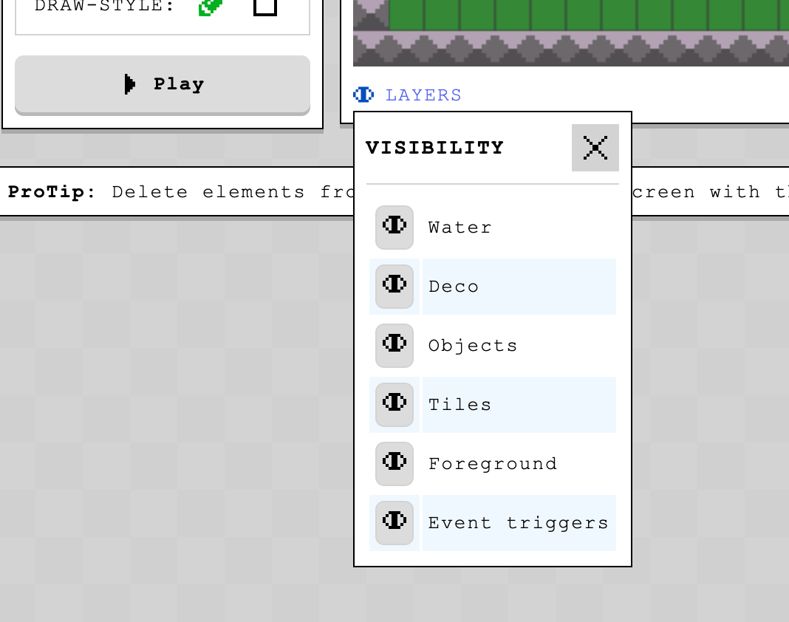
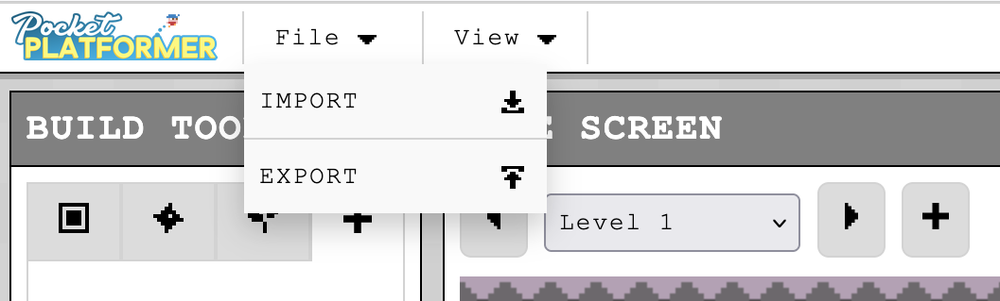

Program your own **jump-and-run game** with Scratch! Create levels, collect items, and let your character hop through exciting worlds. The perfect start into **game development**.

**Step 1:**

- 
step: 'Open "Pocket Platformer" - link is below!'
image:
- 
- 
step: Click on "Run Tool"- 
step: Get started!
image:
- 
- 
step: Create different layers
image:
- 
- 
step: 'Save your game with **File**->**Export**'
image:
- 
- 
step: Let someone else play your game!
