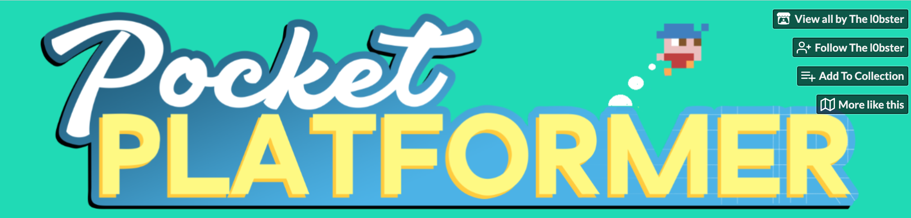
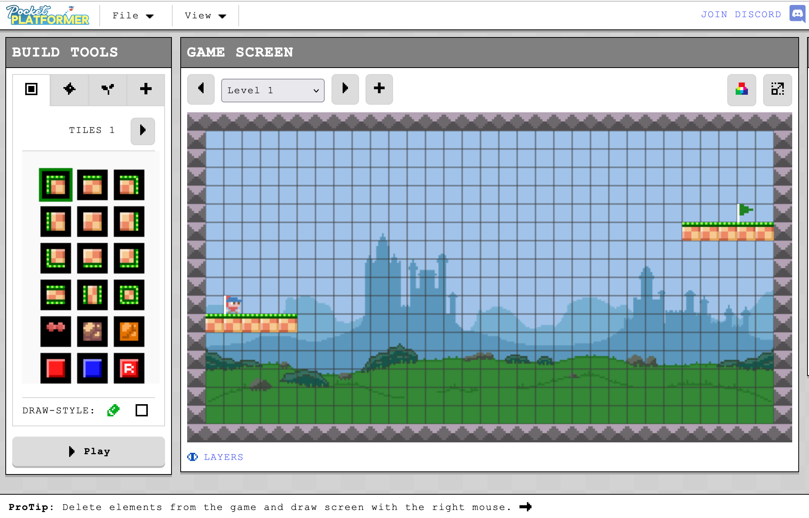
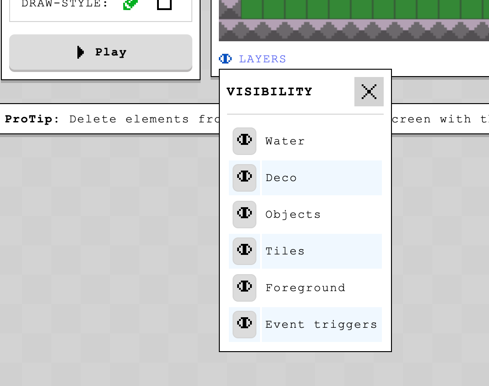
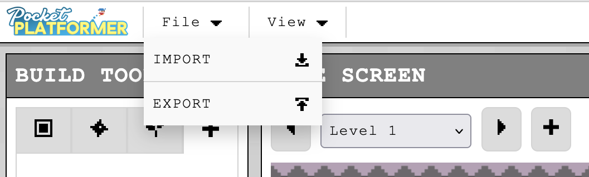

Programmiere dein eigenes **Jump'n'Run Spiel** mit Scratch! Erstelle Level, sammle Items und lasse deine Figur durch spannende Welten hüpfen. Perfekter Einstieg ins **Game Development**.

**Schritt 1:**

- 
step: 'Öffne "Pocket Platformer" - link ist unten!'
image:
- 
- 
step: Klicke auf "Run Tool"- 
step: Leg los!
image:
- 
- 
step: Erstelle verschiedene Layers
image:
- 
- 
step: 'Speichere dein Spiel mit **File**->**Export**'
image:
- 
- 
step: Lass jemand anderen dein Spiel spielen!
