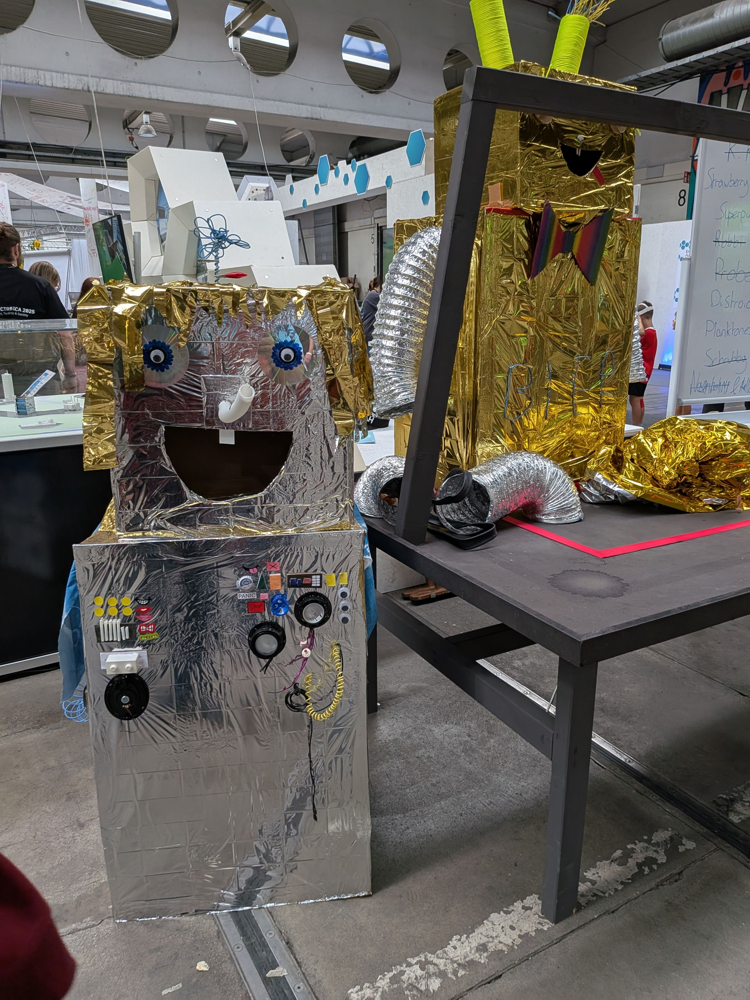

We build robots out of scrap, old toys, and anything that funnily clatters, wobbles, or blinks. With motors, gears, and plenty of imagination, we bring them to life – whether they drive elegantly or just fall over.
At the end, our crazy machines face off in the big robot battle – following the legendary Hebocon rules: whoever fails most spectacularly, wins!

Hebocon – Shitty Robots Hebocon originated in Japan – as a competition for anyone who knows nothing about robotics but wants to build a robot anyway. The term "heboi" comes from Japanese and roughly translates to "lousy" or "badly made." The goal isn't to create the perfect high-tech robot, but the opposite: the wonkiest, funniest, most absurd machines built from scrap that somehow move – and ultimately "fight" each other. It's gloriously chaotic, creative, and full of humour – and that's exactly what kids and teenagers love about it. It's about improvisation, teamwork, and the creative thinking that real engineers have – just in a fun way.
