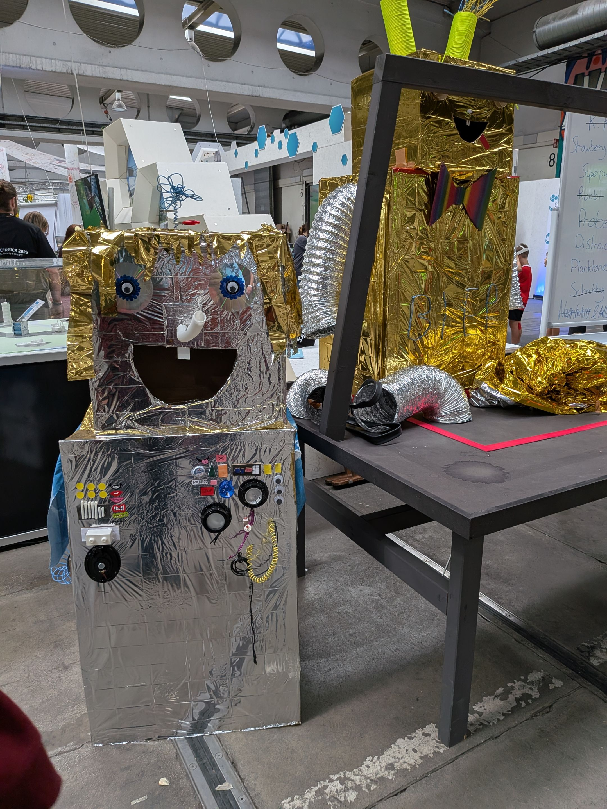

Wir basteln Roboter aus Schrott, altem Spielzeug und allem, was lustig klappert, wackelt oder blinkt. Mit Motoren, Zahnrädern und viel Fantasie erwecken wir sie zum Leben – egal, ob sie elegant fahren oder einfach nur umfallen.
Zum Abschluss treten unsere verrückten Maschinen beim großen Robo-Battle gegeneinander an – ganz nach den legendären Hebocon-Regeln: Wer am schönsten scheitert, gewinnt!

Hebocon – Shitty Robots Hebocon ist ursprünglich in Japan entstanden – als Wettbewerb für alle, die keine Ahnung von Robotik haben, aber trotzdem Roboter bauen wollen. Der Begriff "Heboi" stammt aus dem Japanischen und kann grob als "minderwertig" oder "schlecht gemacht" übersetzt werden. Das Ziel ist nicht, den perfekten Hightech-Roboter zu erschaffen, sondern das Gegenteil: möglichst schiefe, lustige, absurde, aus Schrott gebaute Maschinen, die sich irgendwie bewegen – und am Ende gegeneinander „kämpfen“. Das ist herrlich chaotisch, kreativ und voller Humor – und genau das lieben Kinder und Jugendliche daran. Es geht um Improvisation, Teamarbeit und um das kreative Denken, das in echten Ingenieur:innen steckt – nur eben auf die spaßige Art.
