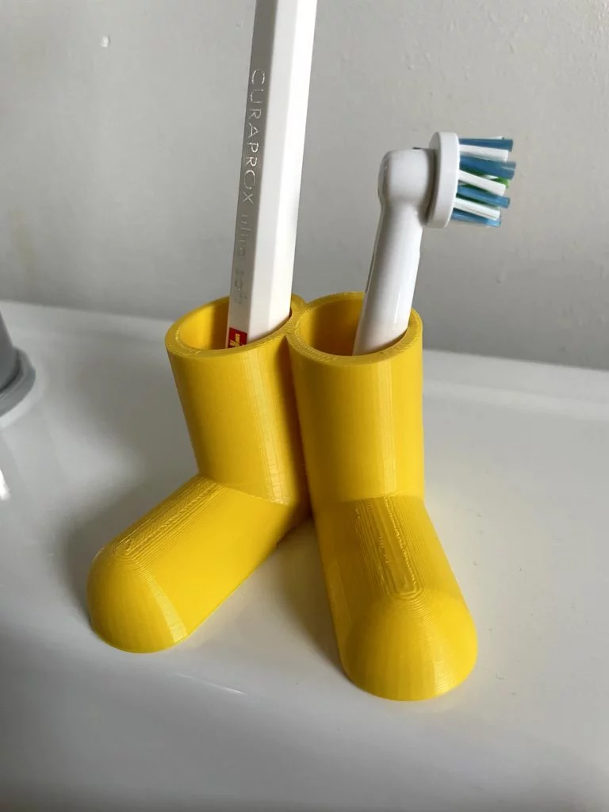

A 3D-printed toothbrush holder shaped like a pair of rubber boots — that's guaranteed to bring a smile! In this project, you'll design your own funny toothbrush holder with TinkerCAD. In the end, you'll have a practical object you can use every day.

## What you need

- A **computer or laptop** with internet access
- An account at [tinkercad.com](https://www.tinkercad.com)
- Access to a **3D printer**
- Your **toothbrush** for measuring!

## Before you start: taking measurements

To make sure the toothbrush actually fits, you need to know how thick it is:

- **Regular toothbrush:** the handle is about 10–12 mm wide
- **Electric toothbrush:** the handle is about 25–30 mm wide

It's best to measure your toothbrush with a ruler. Add **2–3 mm** to the measured diameter — that way the brush fits in comfortably.

## Step 1: Build the basic shape

We'll build the holder as a pair of boots (like in the picture):

1. Open **TinkerCAD** and create a new design
2. Drag a **cylinder** onto the workspace
3. Change the dimensions:
   - **Diameter:** 30 mm (for a regular toothbrush)
   - **Height:** 40 mm
4. That's your first boot shaft!

## Step 2: The hole for the toothbrush

1. Drag a second **cylinder** onto the workspace
2. Turn it into a **hole** (click "Hole" — it will be shown striped)
3. Dimensions:
   - **Diameter:** 15 mm (a bit larger than your toothbrush)
   - **Height:** 45 mm (taller than the boot, so the hole goes all the way through)
4. Position the hole cylinder **centred at the top** of the first cylinder
5. Select both and click **"Group"** (Ctrl+G)

Now you've got a boot with a hole — perfect for the toothbrush!

## Step 3: Shape the boot's foot

A boot needs a foot, of course:

1. Drag a **hemisphere** or a flat **cylinder** onto the workspace
2. Dimensions: about 30 mm wide, 35 mm long, 15 mm high
3. Position it **at the front, bottom** of the shaft — like a boot tip
4. You can also use a rounded box and scale it to fit


**Tip:** use the side view (right in the view cube) to align the parts precisely!


## Step 4: Build the second boot

1. Select your finished boot
2. Press **Ctrl+D** (Duplicate)
3. Position the copy **right next to it** — placing them at a slight angle to each other looks especially fun (like in the photo)
4. Connect the two boots at the bottom with a small flat box as a **base**, so the holder stands stably

## Step 5: Details and decoration

Make your holder unique:

- **Sole:** add a flat box under the boot (a different colour when printing)
- **Texture:** add thin lines to the boot shaft, like stitching
- **A figure instead of boots:** you can of course build a completely different shape — a monster, an animal, a robot... anything goes!
- **Name:** write your name on the front (with the text tool)

## Step 6: Export and print

1. Select everything and **group** it (Ctrl+A, then Ctrl+G)
2. Click **"Export"** → **STL**
3. Open the file in a **slicer** (e.g. Cura or PrusaSlicer)
4. Print settings:
   - **Layer height:** 0.2 mm is enough
   - **Infill:** 15–20% (doesn't need to be solid)
   - **Supports:** only needed if the foot overhangs a lot
5. Print and you're done!


**Important:** before printing, check that the toothbrush really fits! Better to make the hole a bit too big than too small.


## Done!

You've designed and printed your own toothbrush holder. From now on, your toothbrush stands in a genuine one-of-a-kind piece! And when friends ask where you got it, you can say: "I made it myself!"
