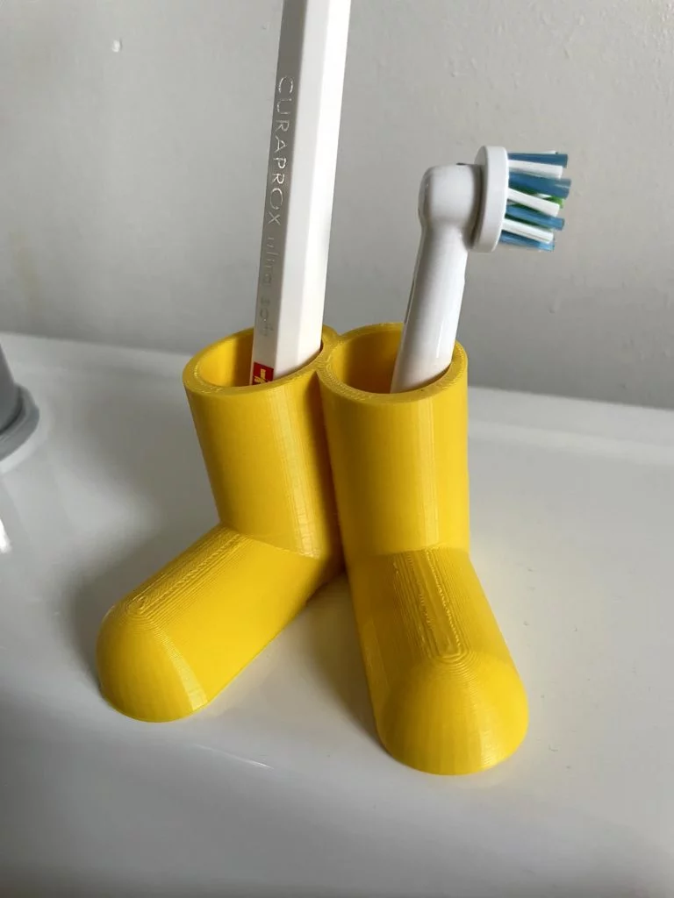

Ein 3D-gedruckter Zahnbürstenhalter, der aussieht wie ein Paar Gummistiefel — das bringt jeden zum Schmunzeln! In diesem Projekt designst du deinen eigenen lustigen Zahnbürstenhalter mit TinkerCAD. Am Ende hast du ein praktisches Objekt, das du jeden Tag benutzen kannst.

## Was du brauchst

- Einen **Computer oder Laptop** mit Internetzugang
- Ein Konto bei [tinkercad.com](https://www.tinkercad.com)
- Zugang zu einem **3D-Drucker**
- Deine **Zahnbürste** zum Maß nehmen!

## Bevor es losgeht: Maße nehmen

Damit die Zahnbürste auch reinpasst, musst du wissen, wie dick sie ist:

- **Normale Zahnbürste:** Der Griff ist ca. 10-12 mm breit
- **Elektrische Zahnbürste:** Der Griff ist ca. 25-30 mm breit

Miss am besten deine Zahnbürste mit einem Lineal nach. Zum gemessenen Durchmesser rechnest du **2-3 mm dazu** — dann passt die Bürste locker rein.

## Schritt 1: Die Grundform bauen

Wir bauen den Halter als Stiefel-Paar (wie auf dem Bild):

1. Öffne **TinkerCAD** und erstelle einen neuen Entwurf
2. Ziehe einen **Zylinder** auf die Arbeitsfläche
3. Ändere die Maße:
   - **Durchmesser:** 30 mm (für eine normale Zahnbürste)
   - **Höhe:** 40 mm
4. Das ist der erste Stiefel-Schaft!

## Schritt 2: Das Loch für die Zahnbürste

1. Ziehe einen zweiten **Zylinder** auf die Fläche
2. Mache ihn zum **Loch** (klicke auf "Bohrung" — er wird gestreift dargestellt)
3. Maße:
   - **Durchmesser:** 15 mm (etwas größer als deine Zahnbürste)
   - **Höhe:** 45 mm (höher als der Stiefel, damit das Loch ganz durchgeht)
4. Platziere den Loch-Zylinder **mittig oben** auf dem ersten Zylinder
5. Wähle beide aus und klicke auf **"Gruppieren"** (Strg+G)

Jetzt hast du einen Stiefel mit Loch — perfekt für die Zahnbürste!

## Schritt 3: Den Stiefel-Fuß formen

Ein Stiefel braucht natürlich einen Fuß:

1. Ziehe eine **Halbkugel** oder einen flachen **Zylinder** auf die Fläche
2. Maße: ca. 30 mm breit, 35 mm lang, 15 mm hoch
3. Platziere ihn **vorne unten** am Schaft — wie eine Schuhspitze
4. Du kannst auch einen abgerundeten Quader nehmen und ihn passend skalieren


**Tipp:** Verwende die Seitenansicht (rechts im Ansichtswürfel), um die Teile genau auszurichten!


## Schritt 4: Den zweiten Stiefel bauen

1. Wähle deinen fertigen Stiefel aus
2. Drücke **Strg+D** (Duplizieren)
3. Platziere die Kopie **direkt daneben** — leicht schräg zueinander sieht es besonders lustig aus (wie auf dem Foto)
4. Verbinde die beiden Stiefel unten mit einem kleinen flachen Quader als **Standfläche**, damit der Halter stabil steht

## Schritt 5: Details und Dekoration

Mache deinen Halter einzigartig:

- **Sohle:** Einen flachen Quader unter den Stiefel setzen (andere Farbe beim Drucken)
- **Textur:** Dünne Linien an den Stiefelschaft setzen, wie Nähte
- **Figur statt Stiefel:** Du kannst natürlich auch eine ganz andere Form bauen — ein Monster, ein Tier, ein Roboter... alles ist erlaubt!
- **Name:** Schreibe deinen Namen vorne drauf (mit dem Text-Tool)

## Schritt 6: Exportieren und Drucken

1. Wähle alles aus und **gruppiere** es (Strg+A, dann Strg+G)
2. Klicke auf **"Exportieren"** → **STL**
3. Öffne die Datei im **Slicer** (z.B. Cura oder PrusaSlicer)
4. Druckeinstellungen:
   - **Schichtdicke:** 0.2 mm reicht aus
   - **Füllung:** 15-20% (muss nicht massiv sein)
   - **Stützmaterial:** nur nötig, wenn der Fuß stark übersteht
5. Drucken und fertig!


**Wichtig:** Prüfe vor dem Drucken, ob die Zahnbürste wirklich reinpasst! Lieber das Loch etwas größer machen als zu klein.


## Geschafft!

Du hast deinen eigenen Zahnbürstenhalter designt und gedruckt. Ab jetzt steht deine Zahnbürste in einem echten Unikat! Und wenn Freunde fragen, wo du den her hast, kannst du sagen: "Den hab ich selbst gemacht!"
