Design your own **chess set** completely from scratch! From the pieces to the board - everything is designed with **TinkerCAD** and made on the 3D printer. A creative project for advanced designers.

You can find a template for a chess set with peg-and-hole mounts (travel chess, where the pieces stay in place...) here:
[TinkerCAD chess pieces & board](https://www.tinkercad.com/things/fGxWGQV9NuJ-vorlage-schachbrett)

## Impressions from the chess set project

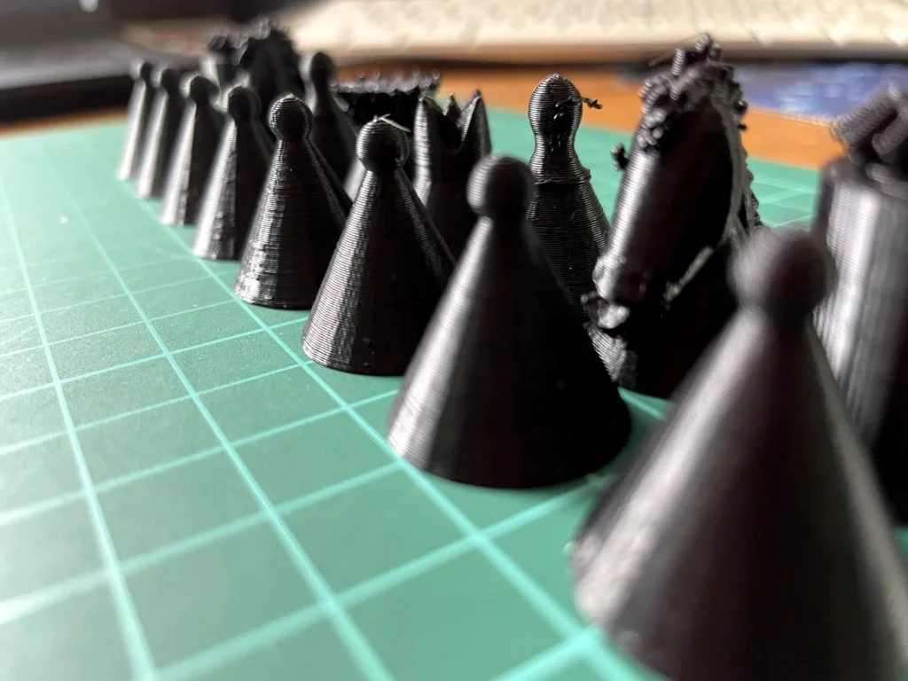


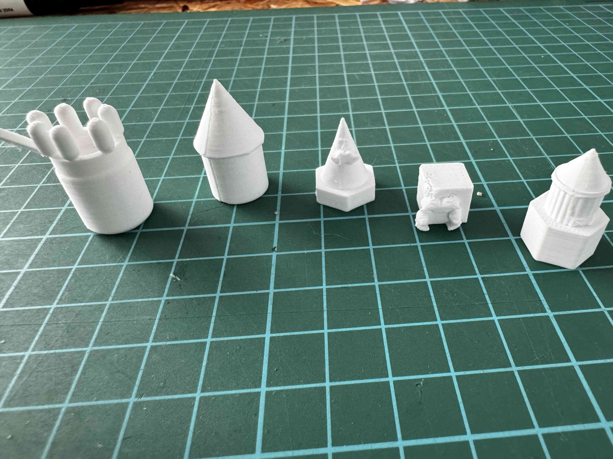
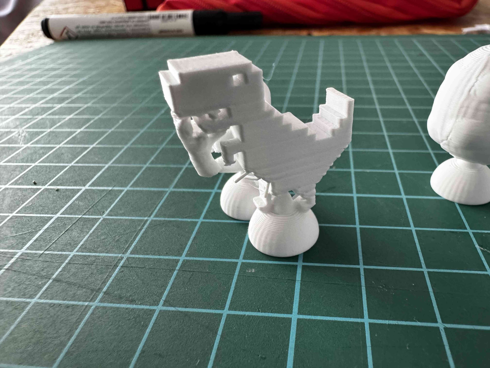
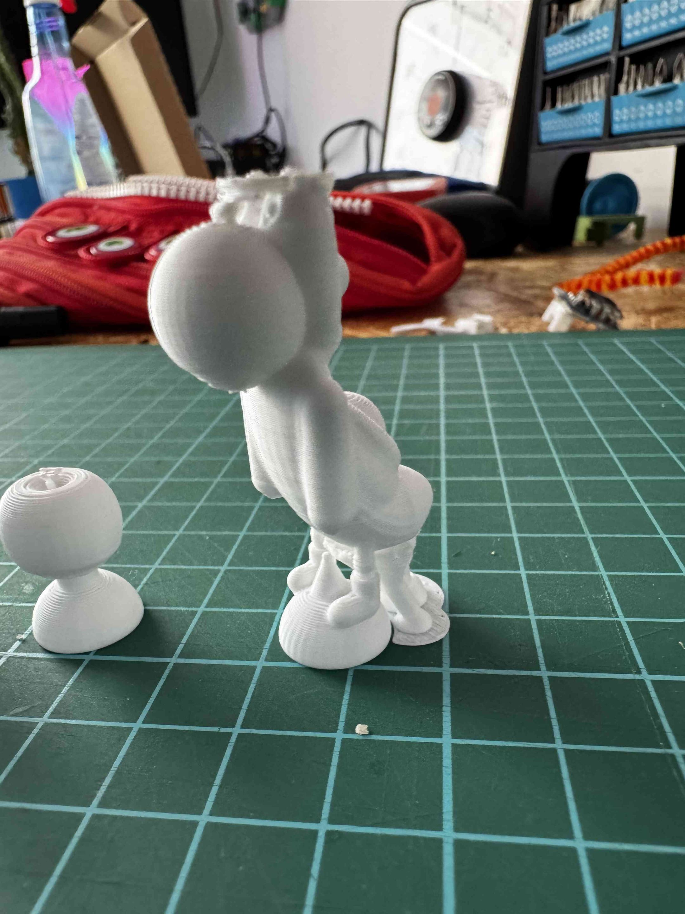
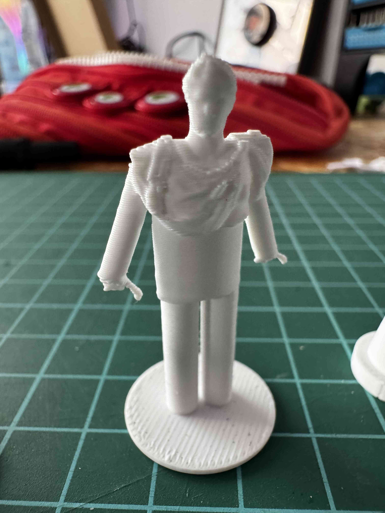
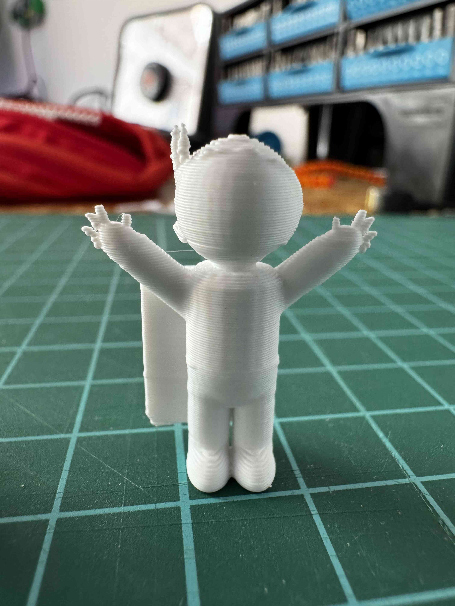
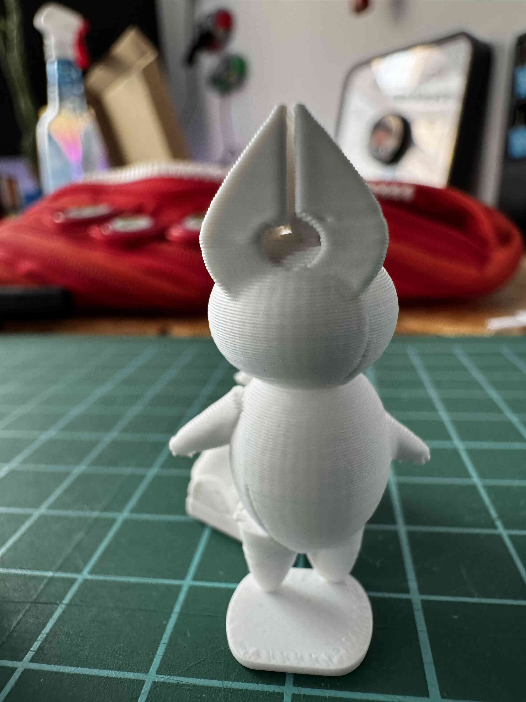
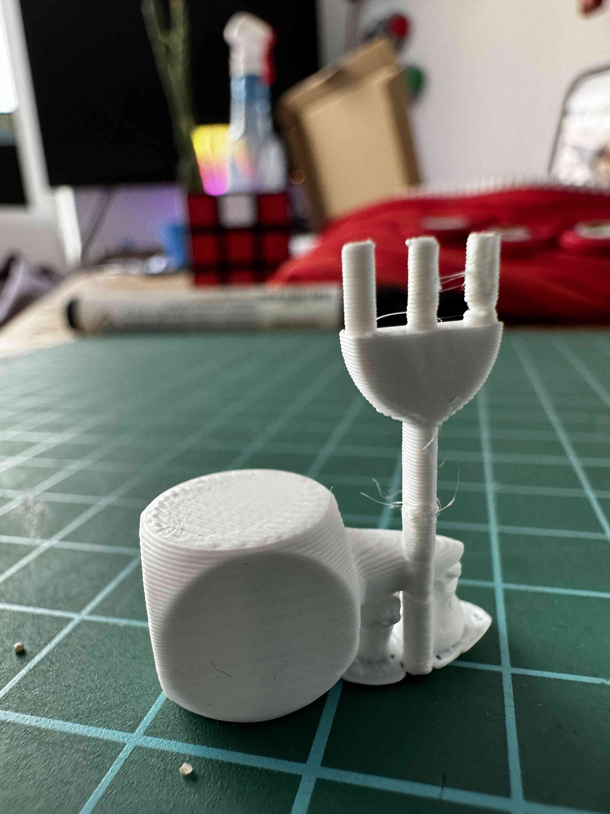
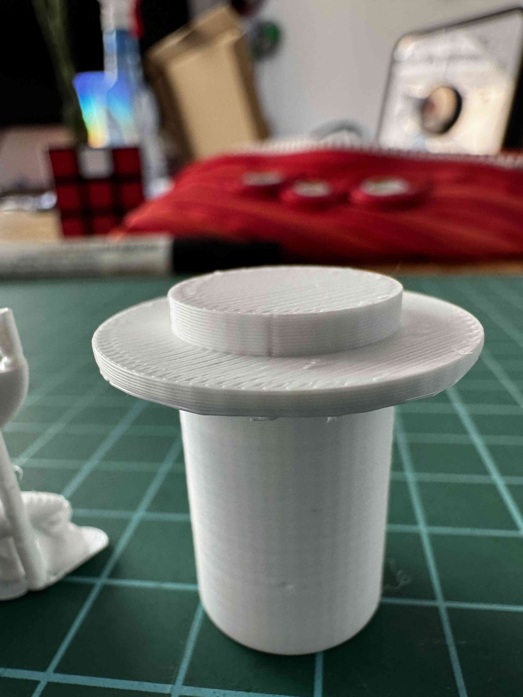
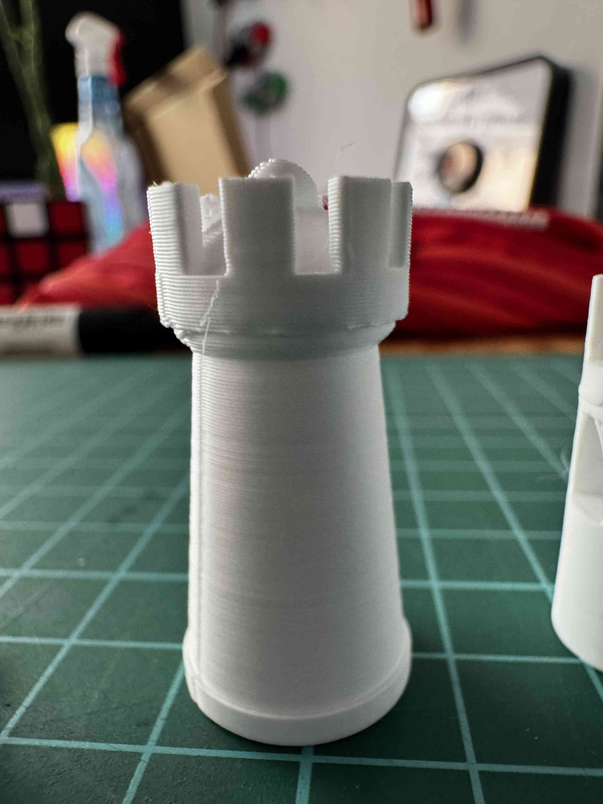
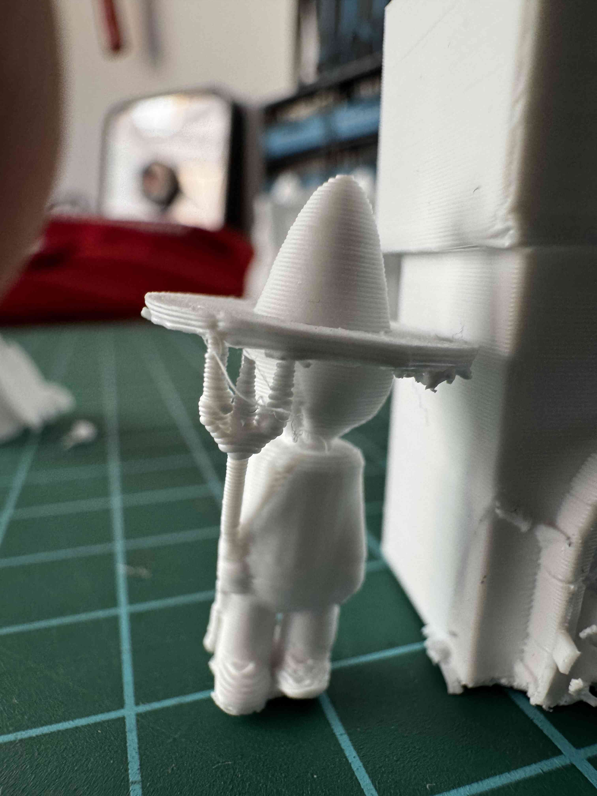
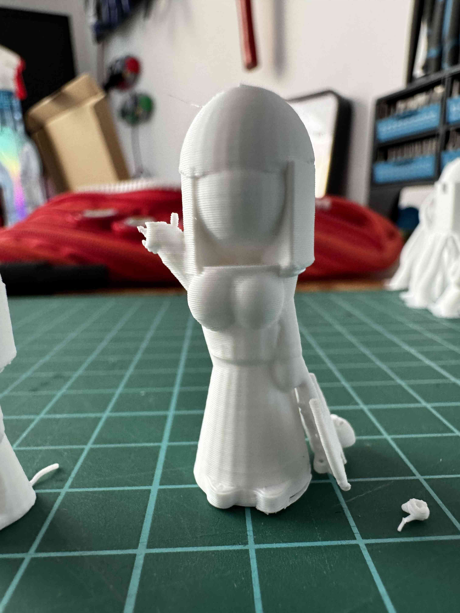

