Entwerfe dein eigenes **Schachspiel** komplett selbst! Von den Figuren bis zum Spielbrett - alles wird mit **TinkerCAD** gestaltet und am 3D-Drucker hergestellt. Ein kreatives Projekt für fortgeschrittene Designer.

eine Vorlage für ein Schachspiel mit Noppsies-Halterung (Reiseschach, das die Figuren halten...) findest du hier:
[TinkerCAD Schachfiguren & Brett](https://www.tinkercad.com/things/fGxWGQV9NuJ-vorlage-schachbrett)

## Impressionen vom Schachspiel-Projekt

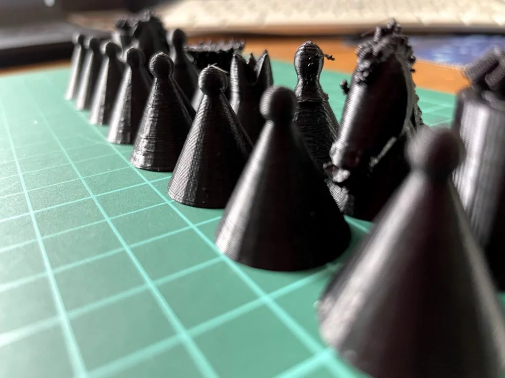


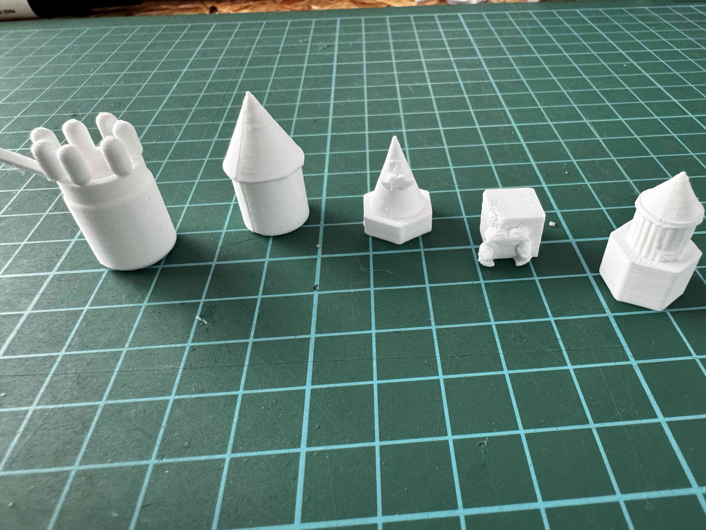
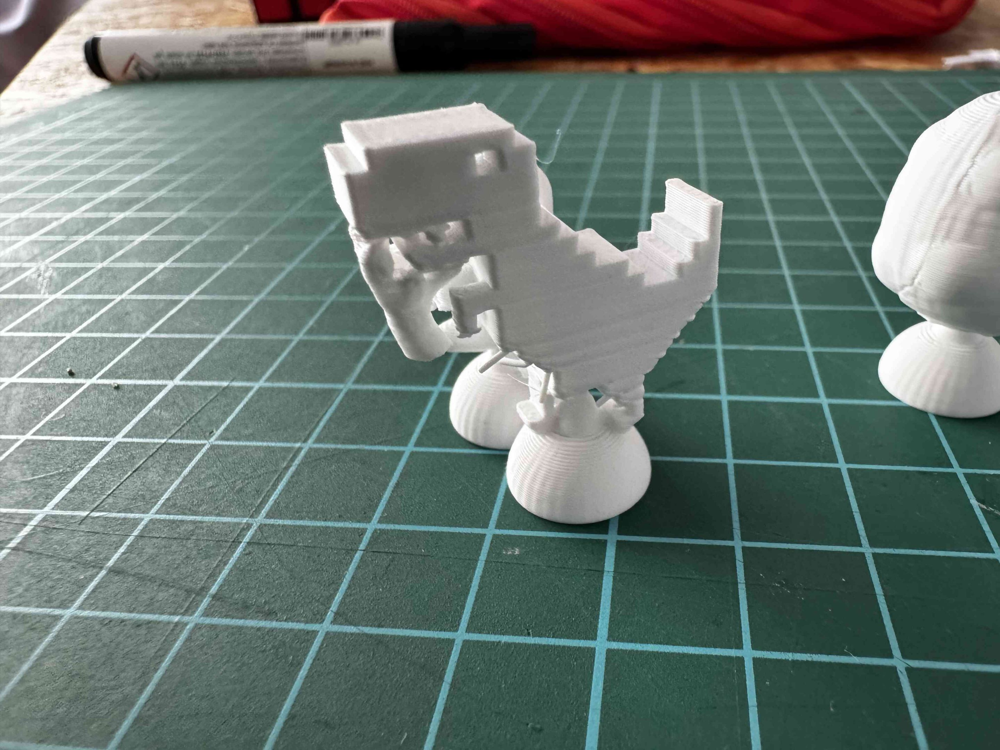
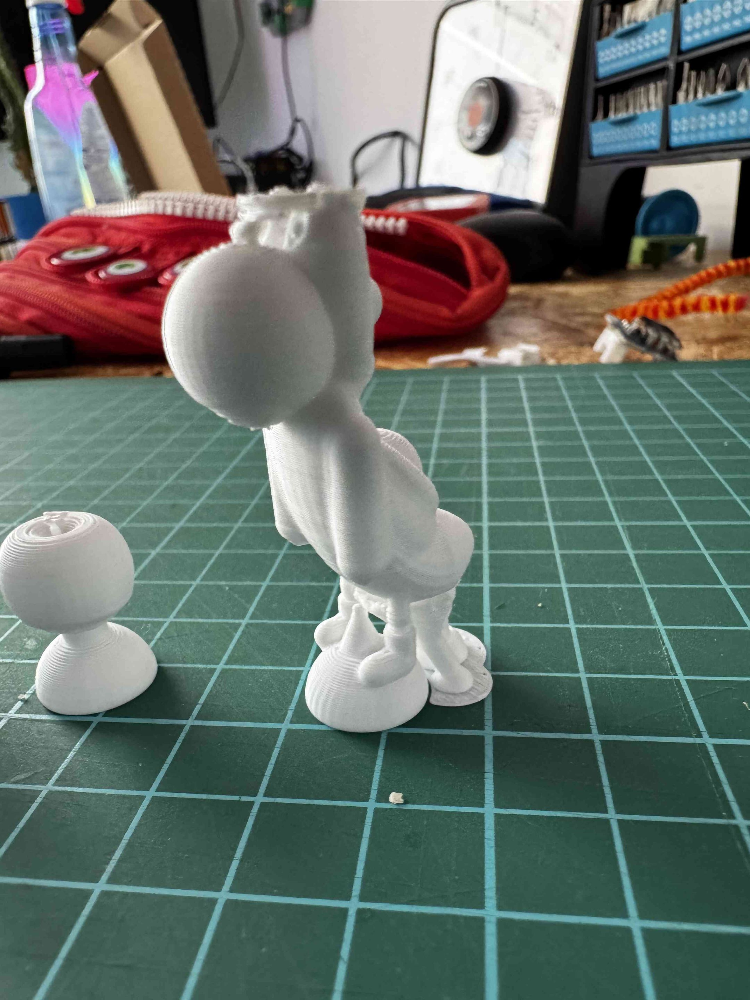
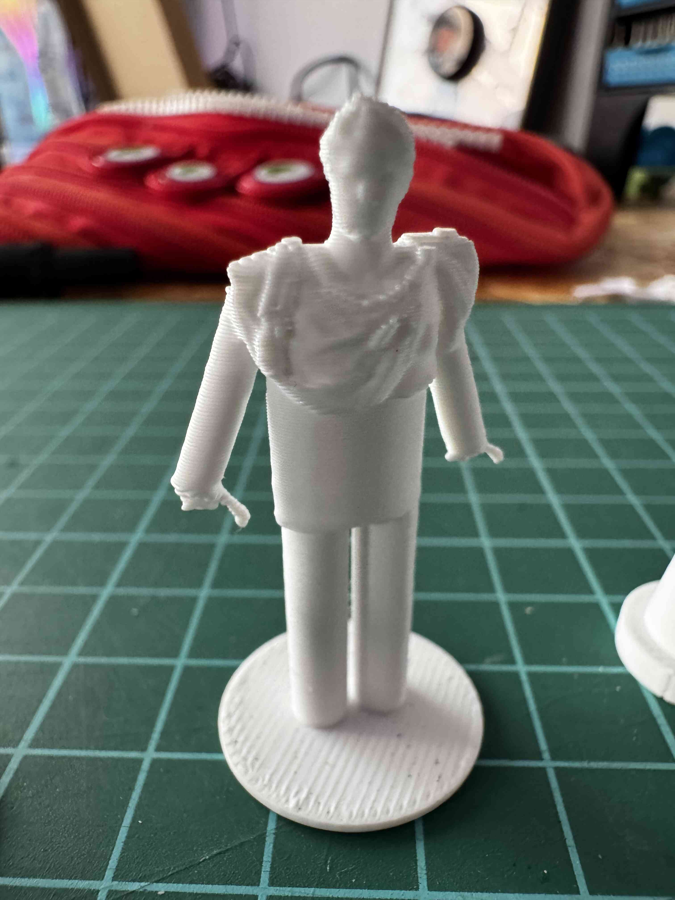
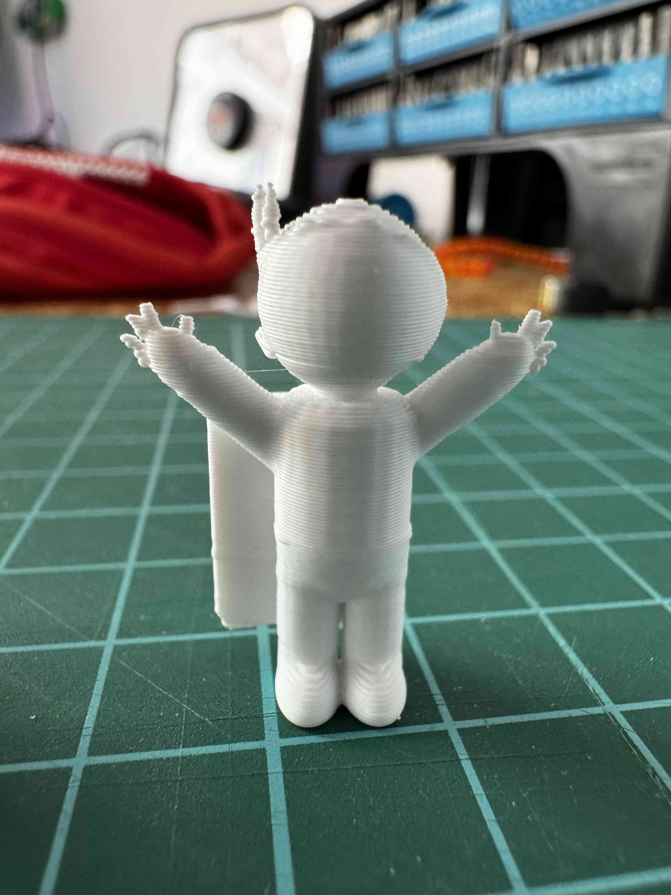
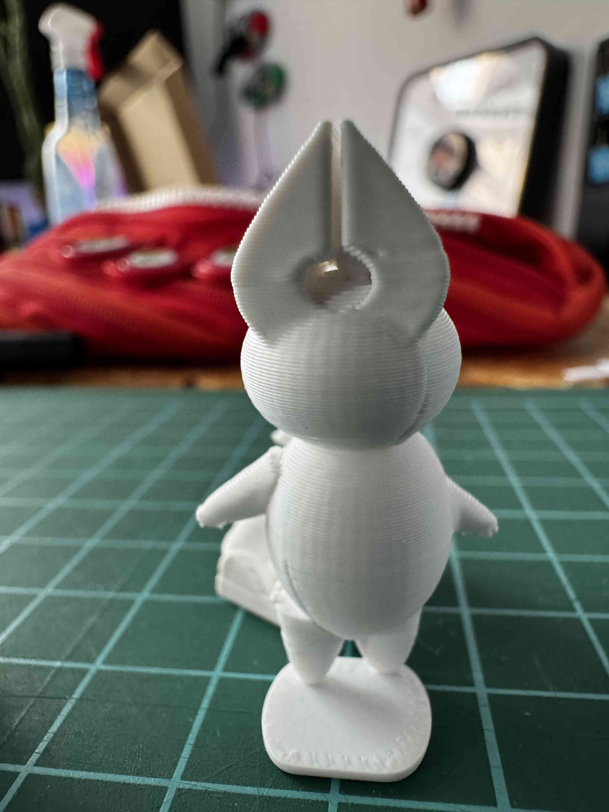
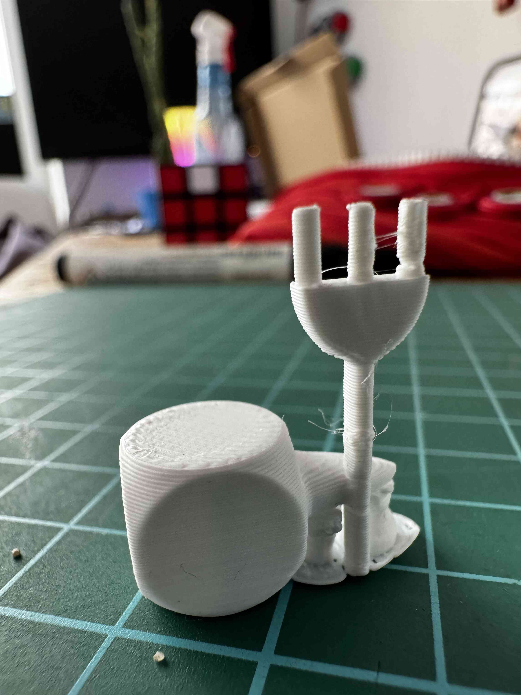
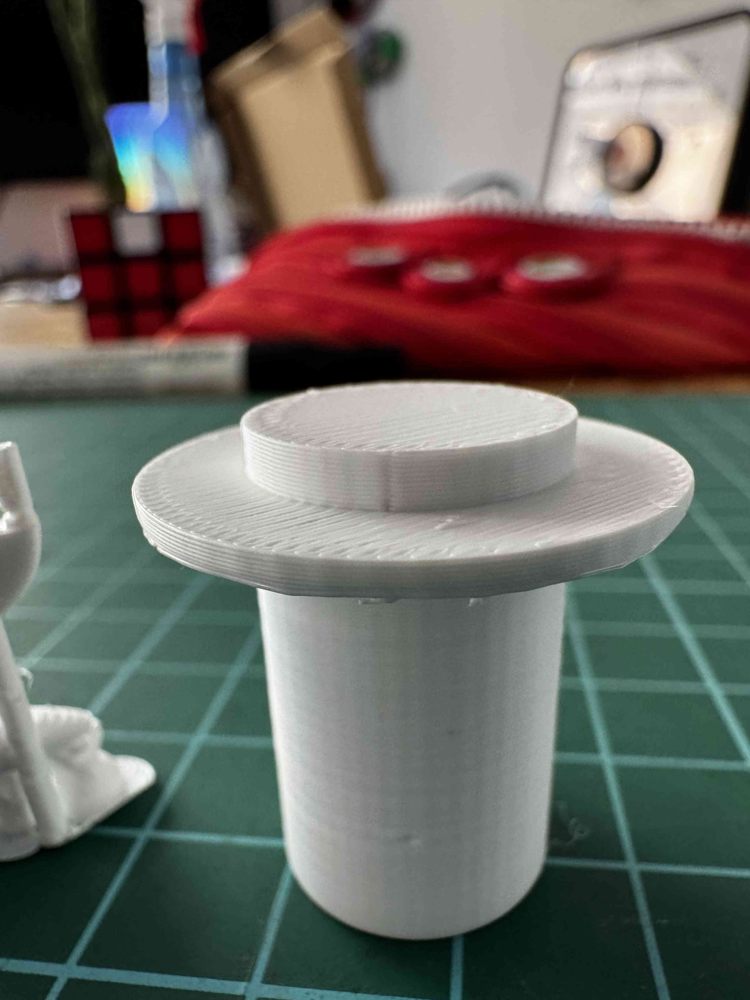
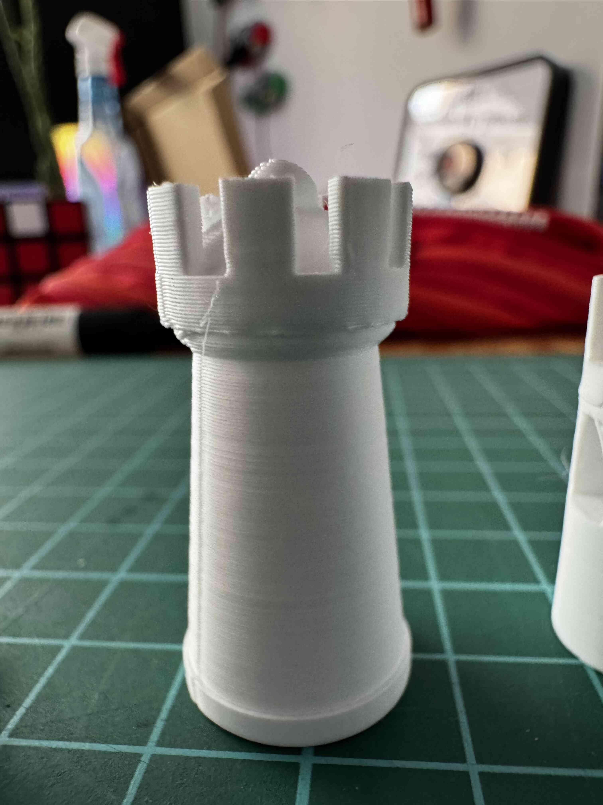
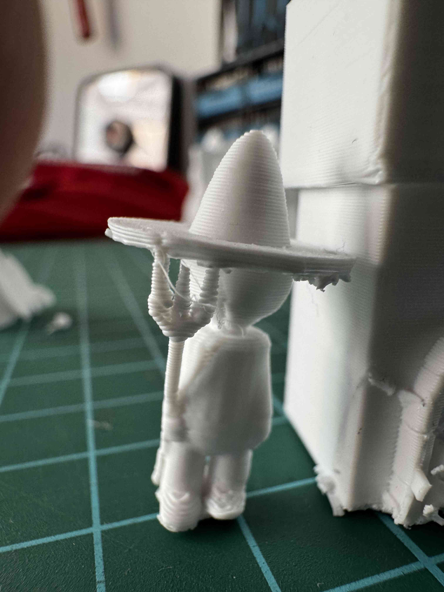
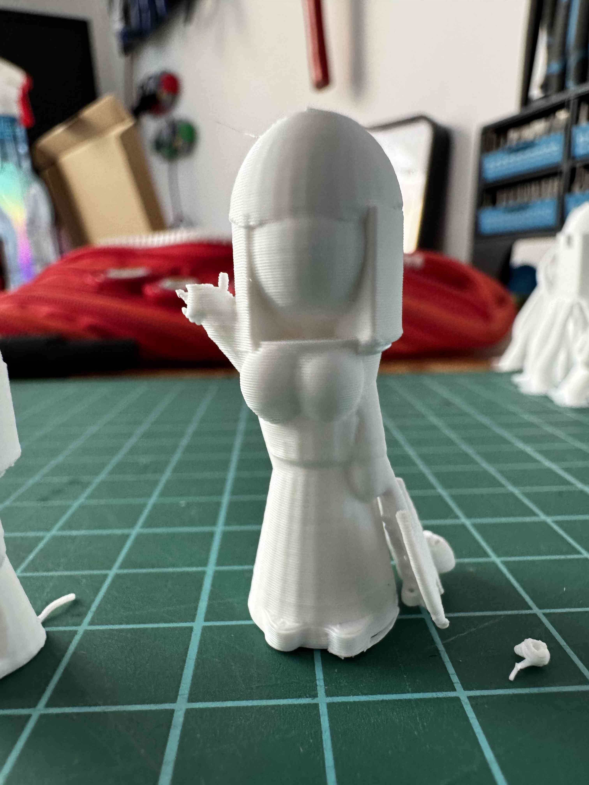

