Design your personal **3D nameplate** with TinkerCAD! Learn the basics of digital design and create a unique plate with your name. Perfect for beginners in **3D printing**.

**Step 1:**

- 
step: Open TinkerCAD and sign in
image:
- 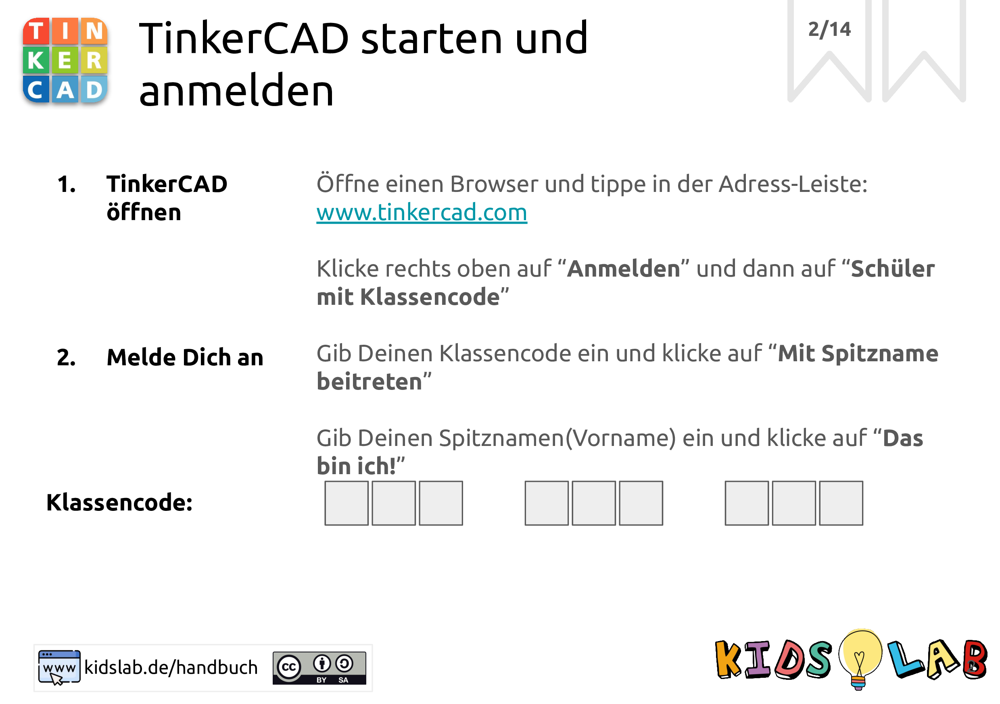
- 
step: Take a look at the homepage
image:
- 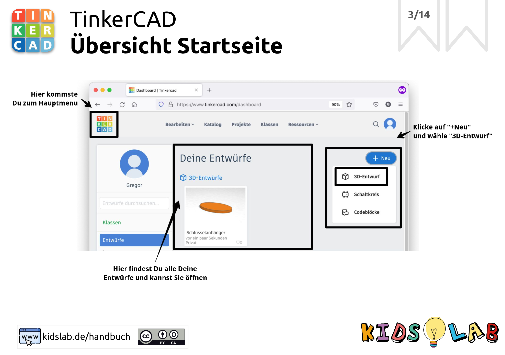
- 
step: These are the workspaces
image:
- 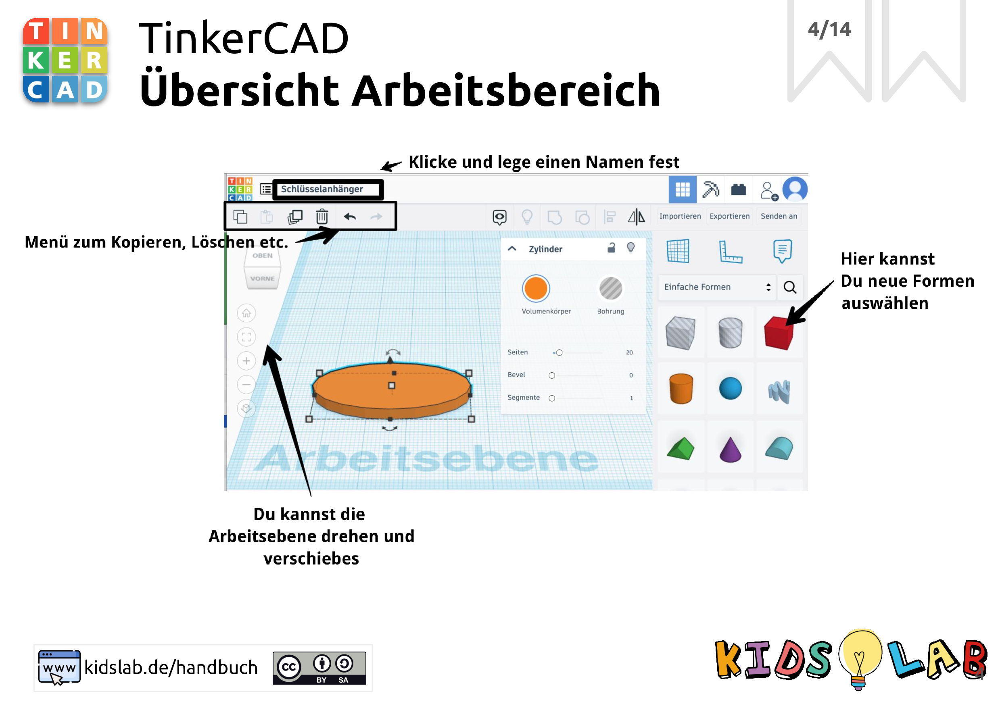
- 
step: >
Choose a basic shape and drag it onto
the workspace
image:
- 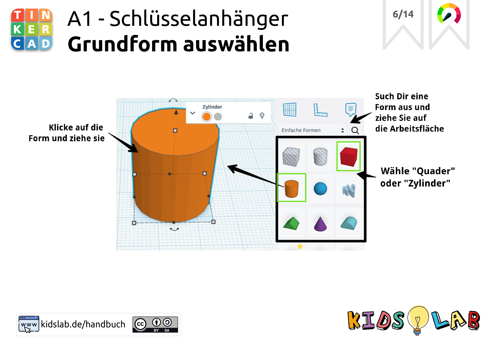
- 
step: Set the size
image:
- 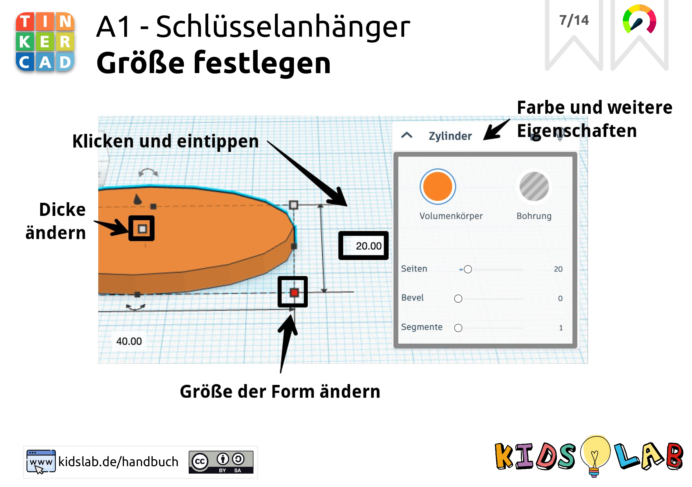
- 
step: 'Challenge: change the colour and more!'
image:
- 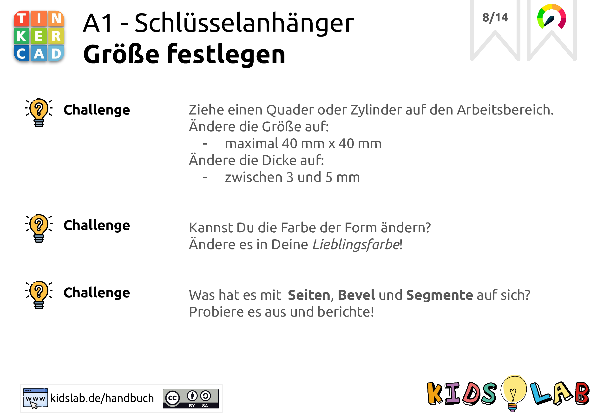
- 
step: Add your name
image:
- 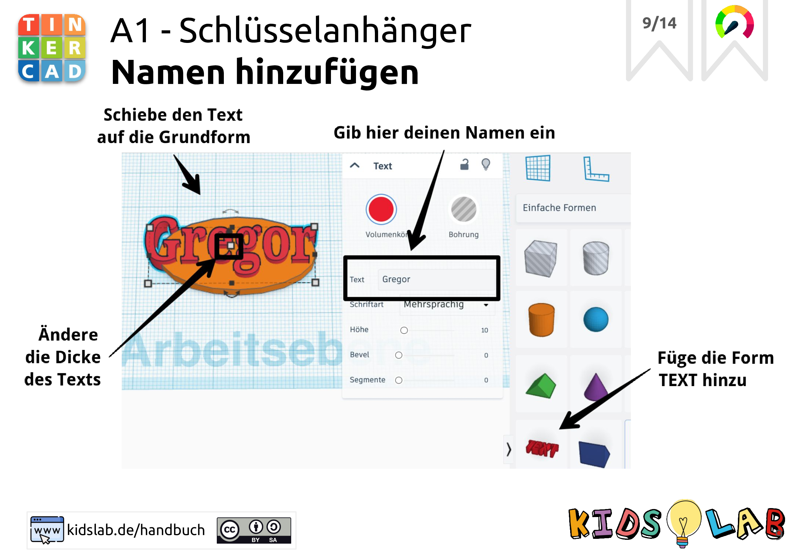
- 
step: 'Challenge: adjust the font!'
image:
- 
- 
step: Drill a hole
image:
- 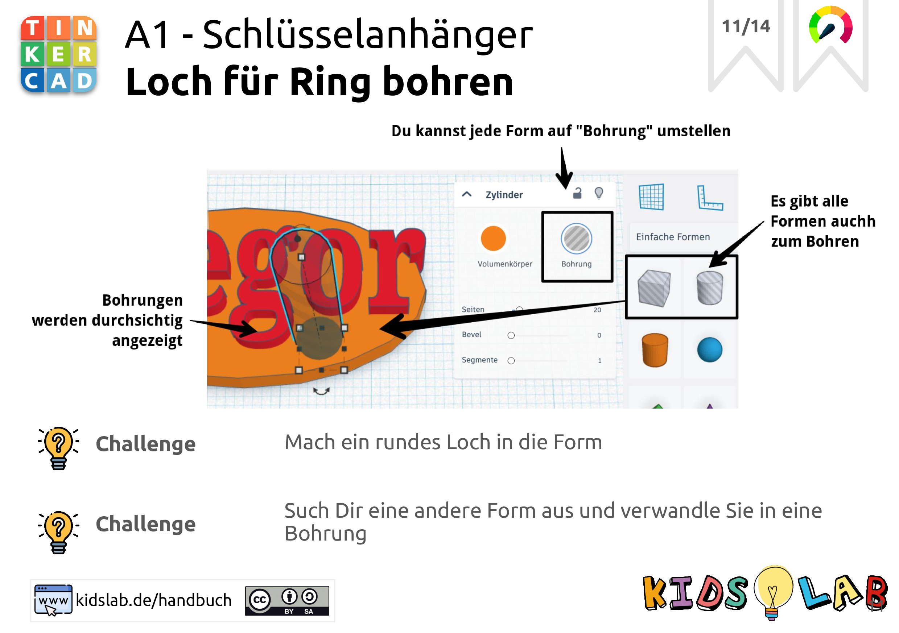
- 
step: Group everything
image:
- 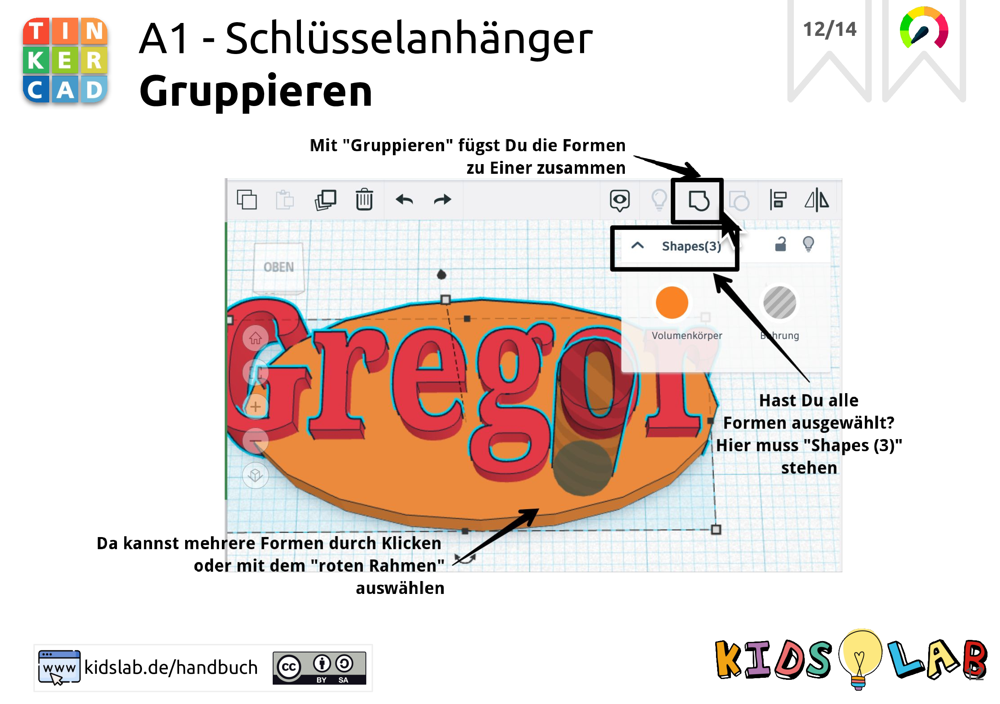
- 
step: Select correctly
image:
- 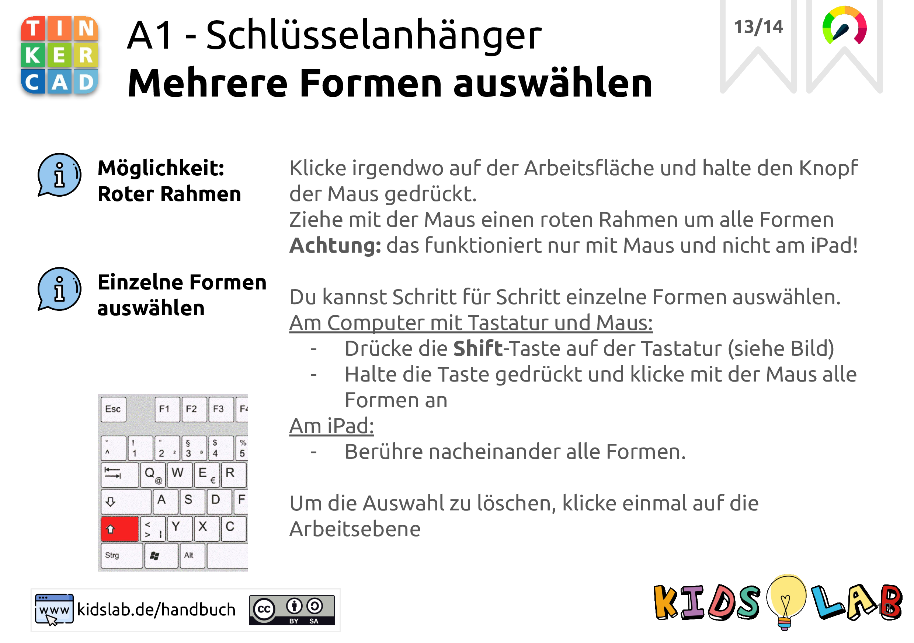
- 
step: 'Done! Your nameplate is ready - print it out!'
image:
- 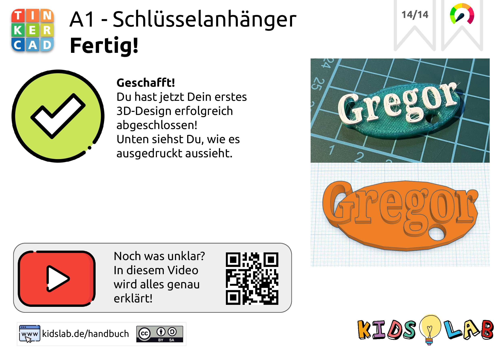
