Gestalte dein persönliches **3D-Namensschild** mit TinkerCAD! Lerne die Grundlagen des digitalen Designs und erstelle ein einzigartiges Schild mit deinem Namen. Perfect für Anfänger im **3D-Druck**.

**Schritt 1:**

- 
step: Tinkercad öffnen und anmelden
image:
- 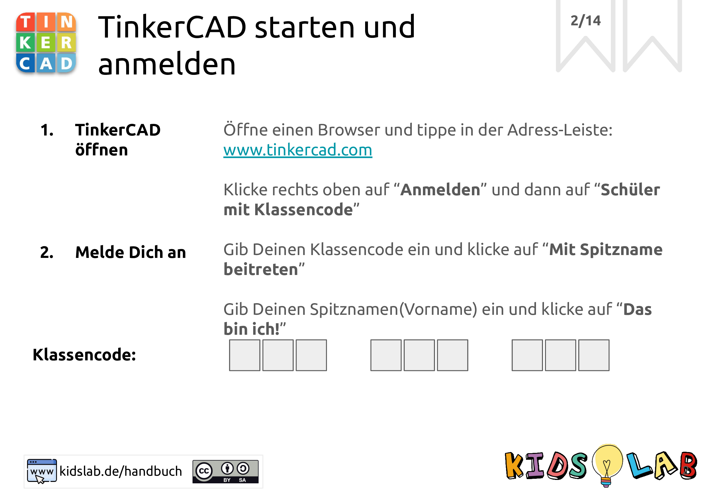
- 
step: Schau dir die Startseite an
image:
- 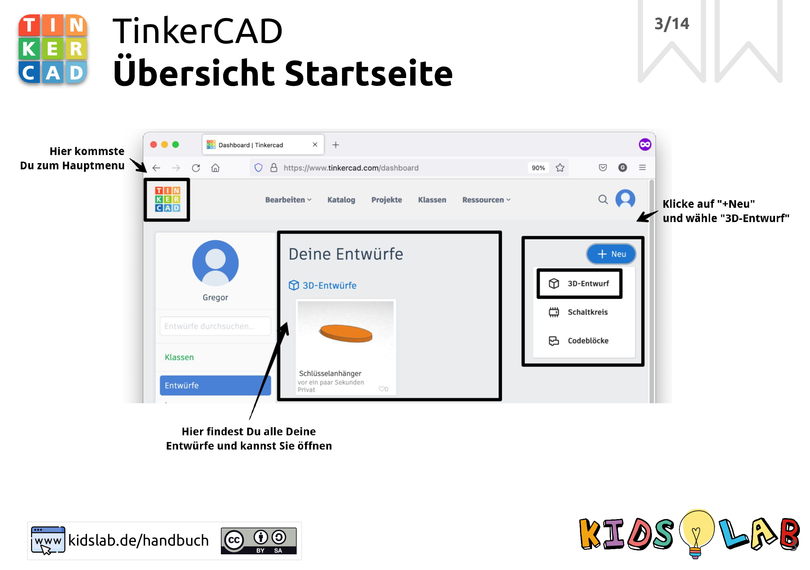
- 
step: Das sind die Arbeitsbereiche
image:
- 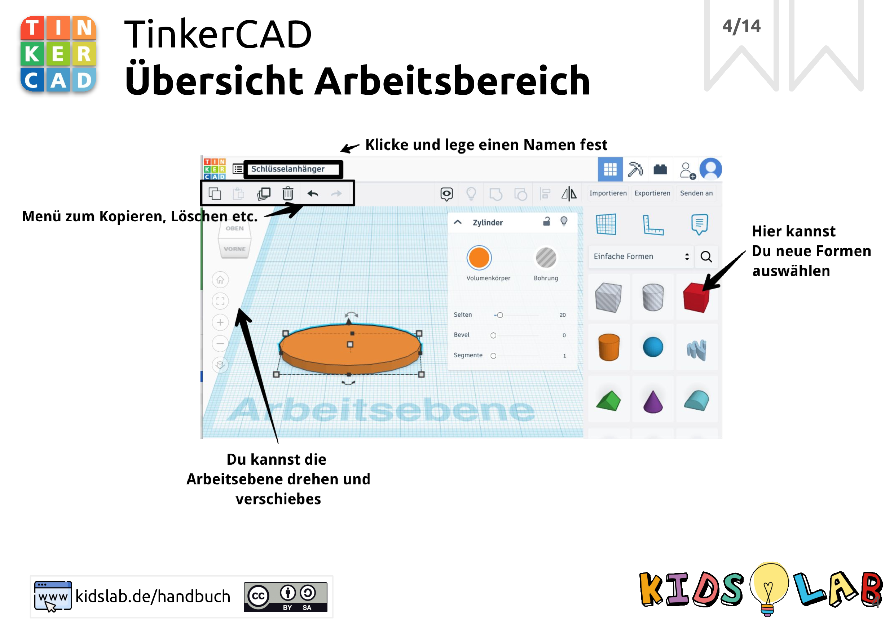
- 
step: >
Wähle eine Grundform und ziehe sie auf
den Arbeitsbereich
image:
- 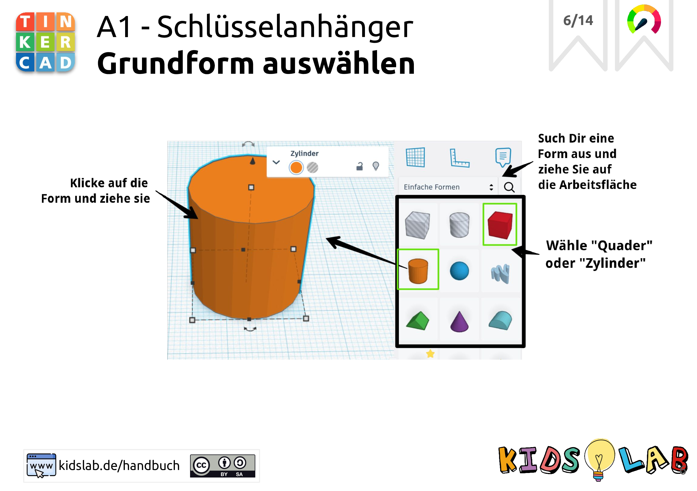
- 
step: Lege die Größe fest
image:
- 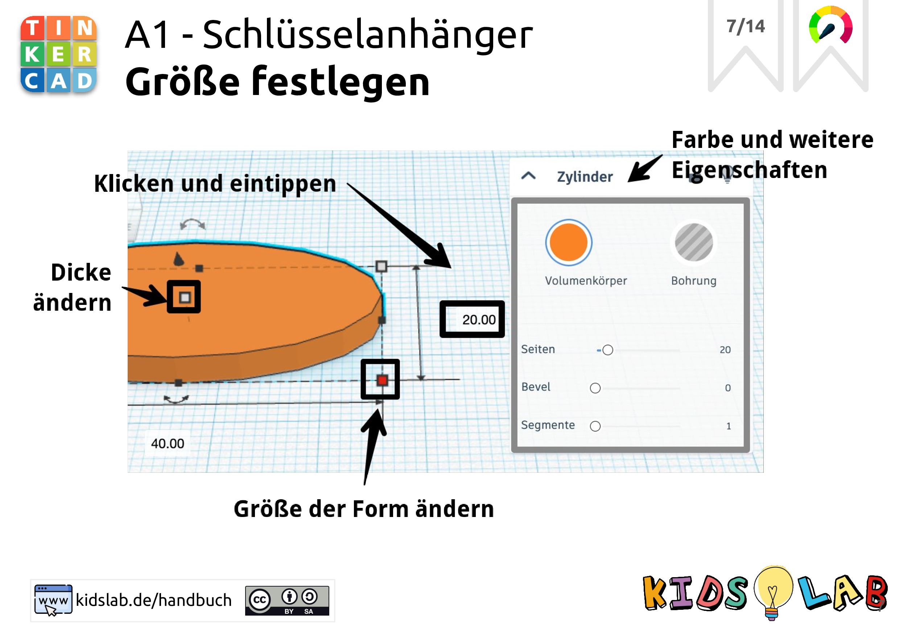
- 
step: 'Challenge: Farbe ändern und mehr!'
image:
- 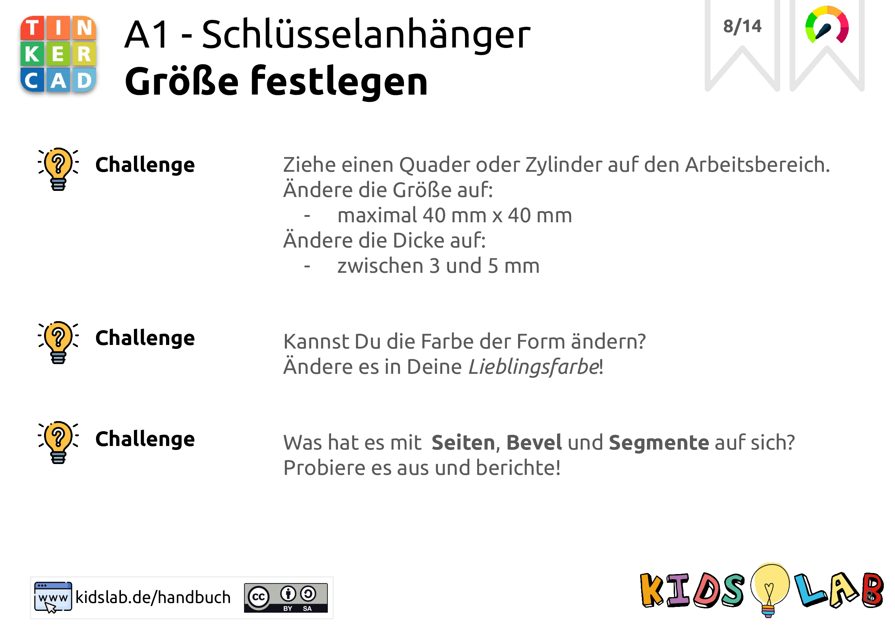
- 
step: Füge deinen Namen ein
image:
- 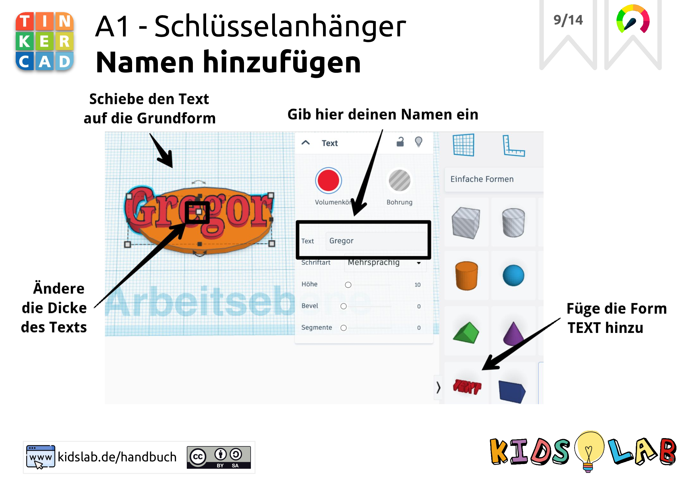
- 
step: 'Challenge: Passe die Schrift an!'
image:
- 
- 
step: Bohre ein Loch
image:
- 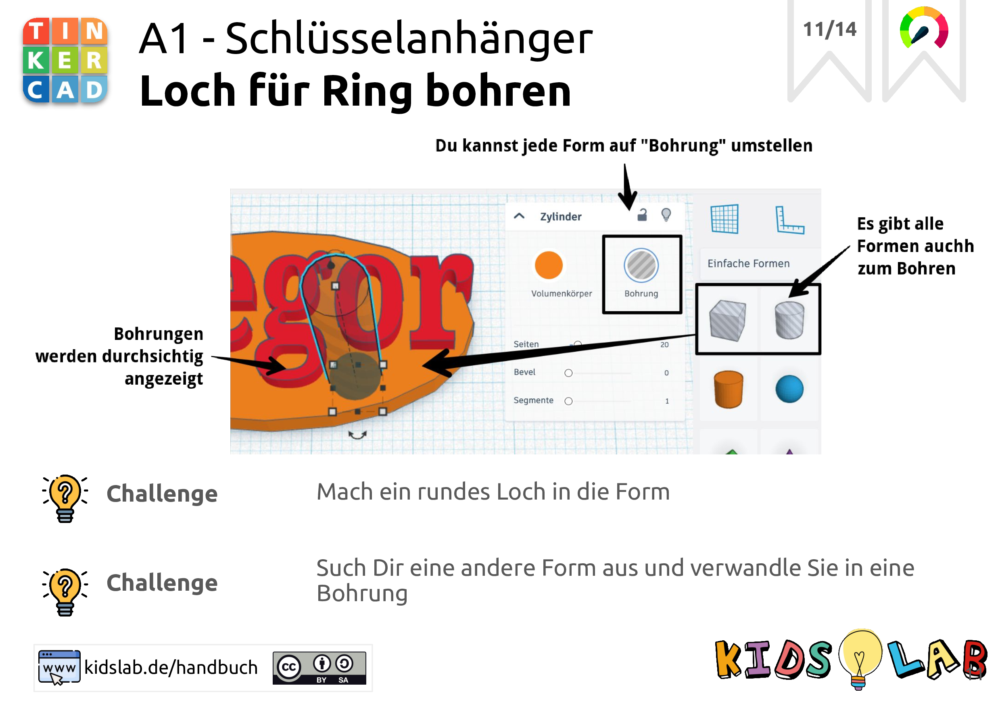
- 
step: Alles Gruppieren
image:
- 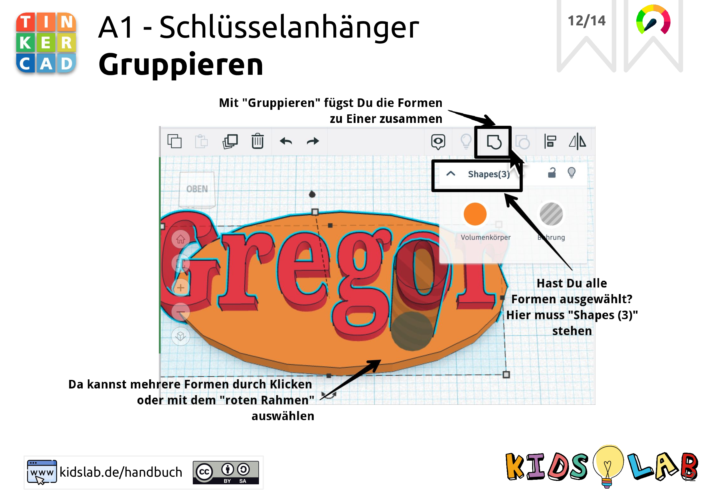
- 
step: Richtig auswählen
image:
- 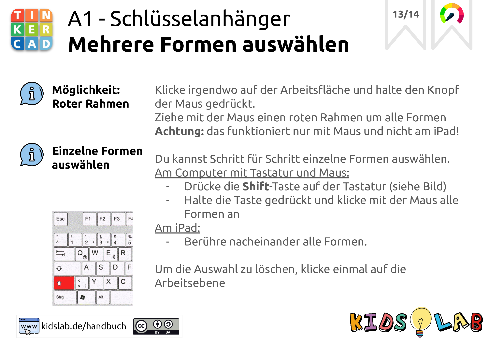
- 
step: 'Fertig! Dein Namensschild ist fertig - druck es aus!'
image:
- 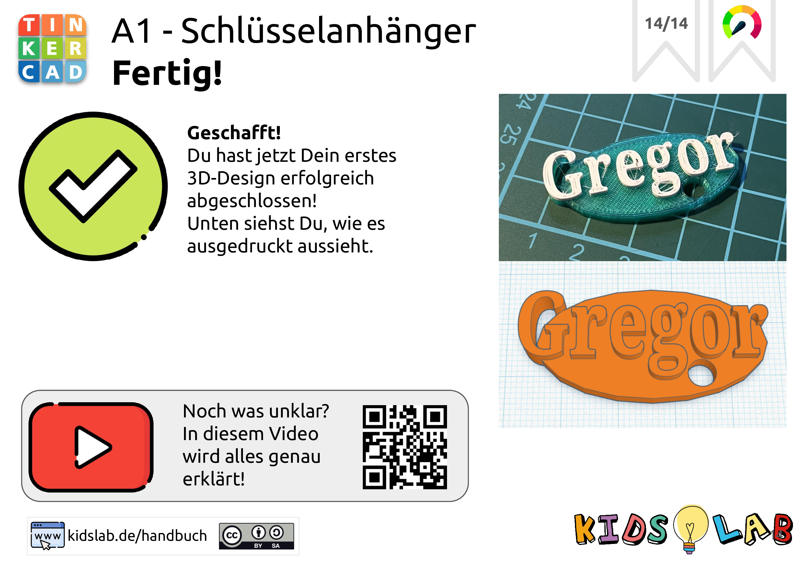
