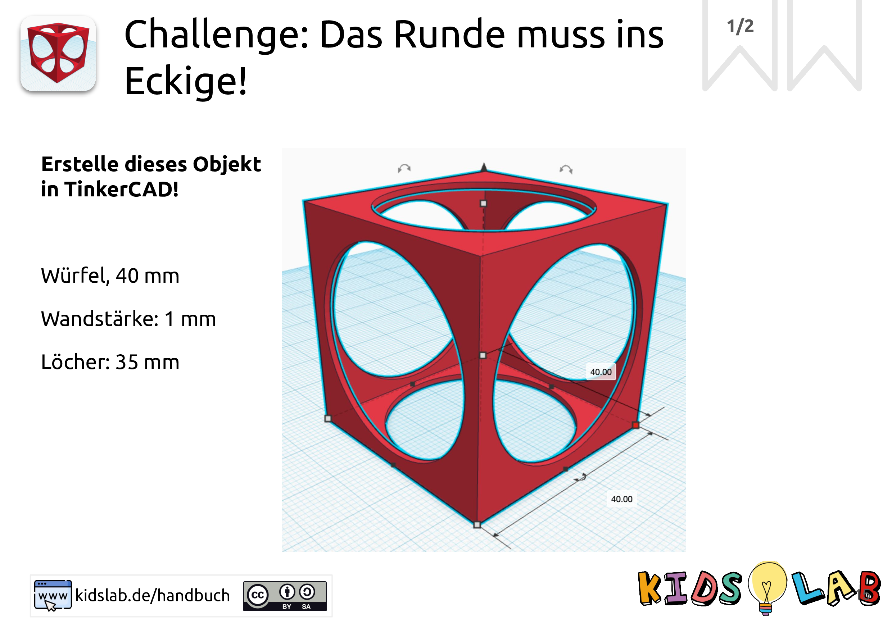
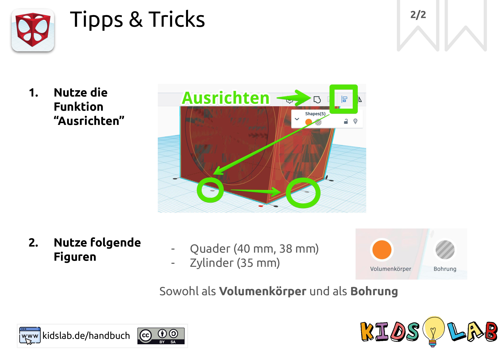

Create this cube - looks tricky, but it isn't!

**Step 1:**

- 
step: 'Challenge: create a cube like in the picture!'
image:
- 
- 
step: 'Tips & tricks!'
image:
- 
- 
step: Done! Print it right away!
