> KidsLab — who we are and what drives us.

KidsLab is a nonprofit organisation in Augsburg, Germany. We do maker education for children and teenagers: coding, crafting, building, experimenting. Our goal is to get young people excited about technology and creativity.

#### Our vision & mission

The digital age has long since become part of our everyday life. It's not just since the Covid pandemic that we've felt how important digital education and strengthening digital skills are for our children and teenagers.

That's why we, Regine Scheyer and Gregor Walter, founded KidsLab gGmbH. Our nonprofit organisation pursues exclusively charitable purposes. Our goal is to promote education in computer science and media in order to sustainably strengthen children and teenagers and prepare them for the future.


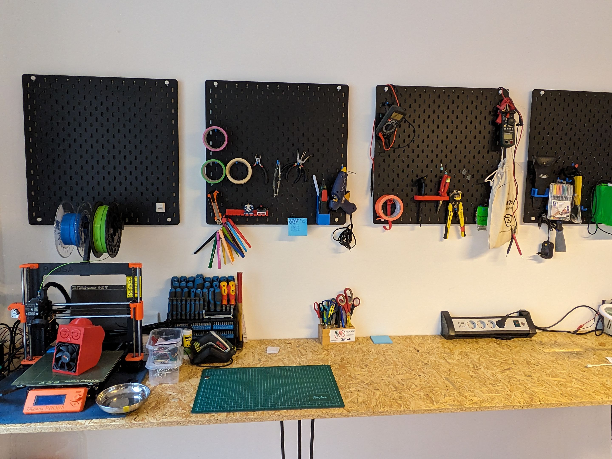
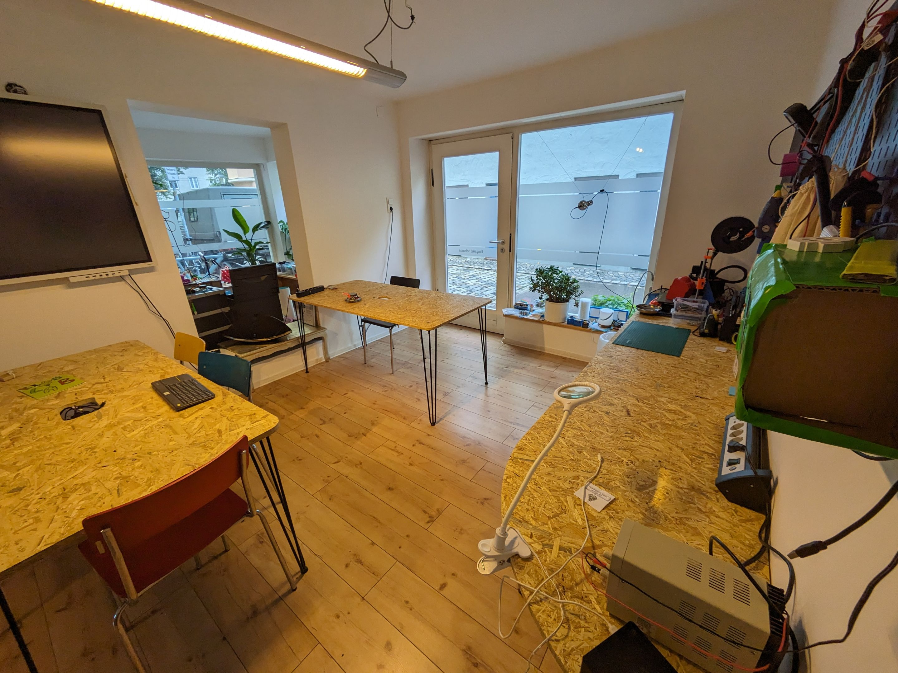
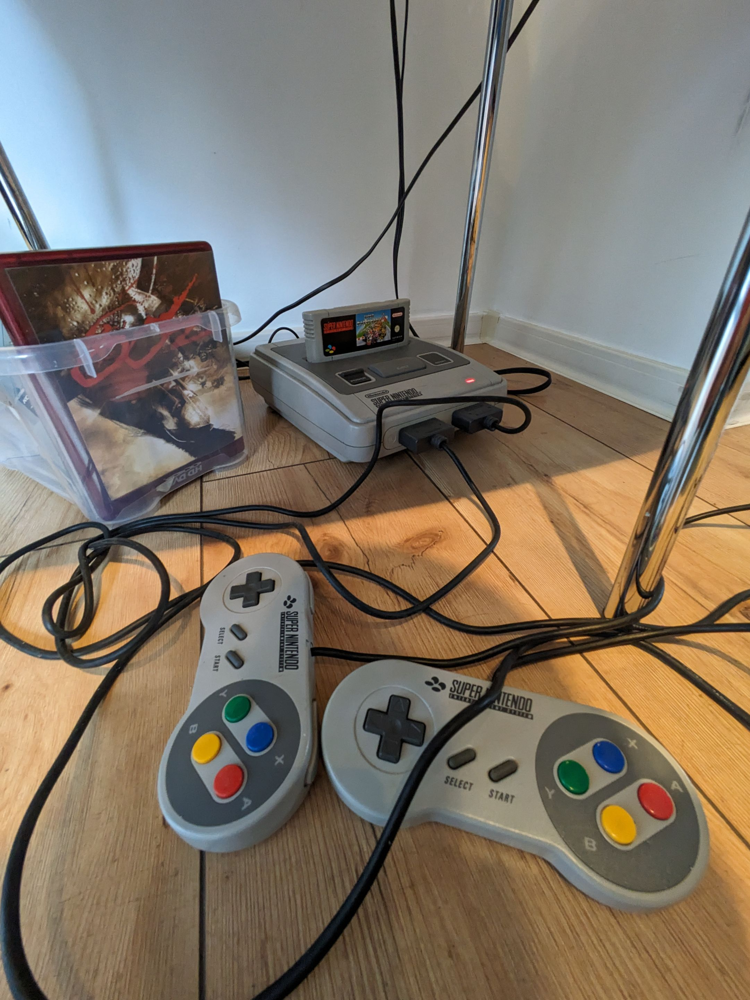
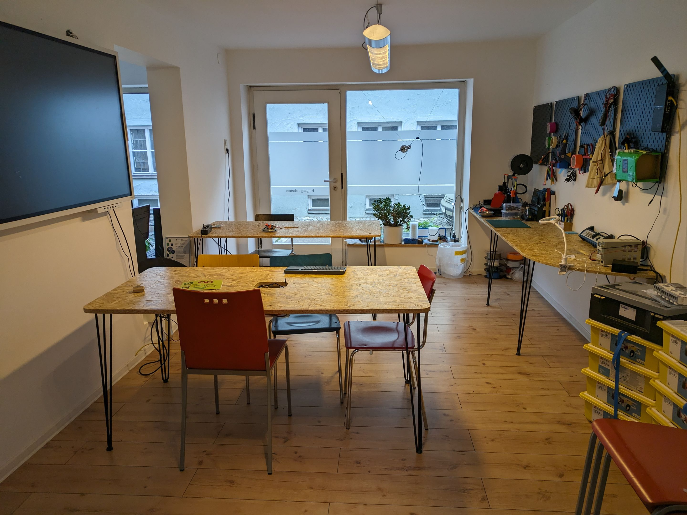
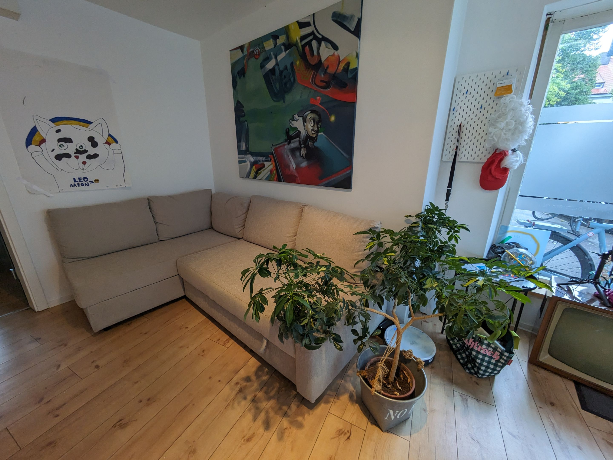
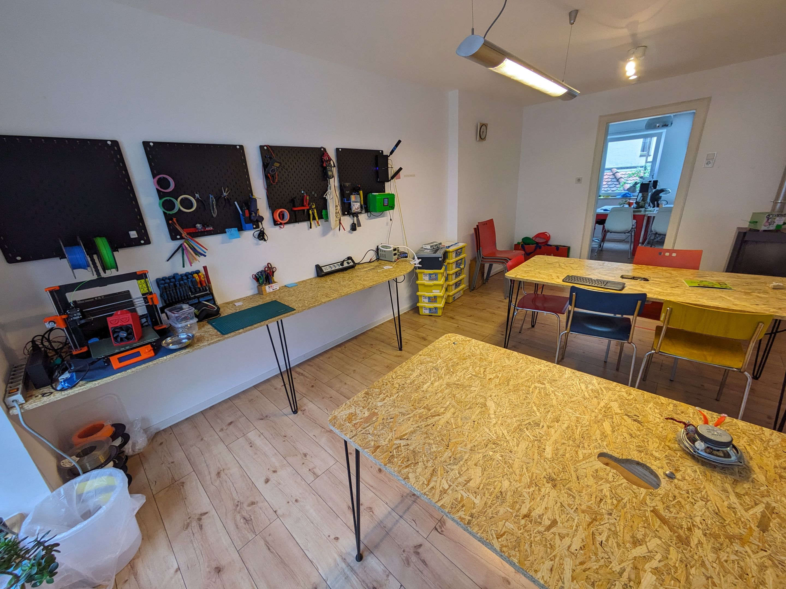
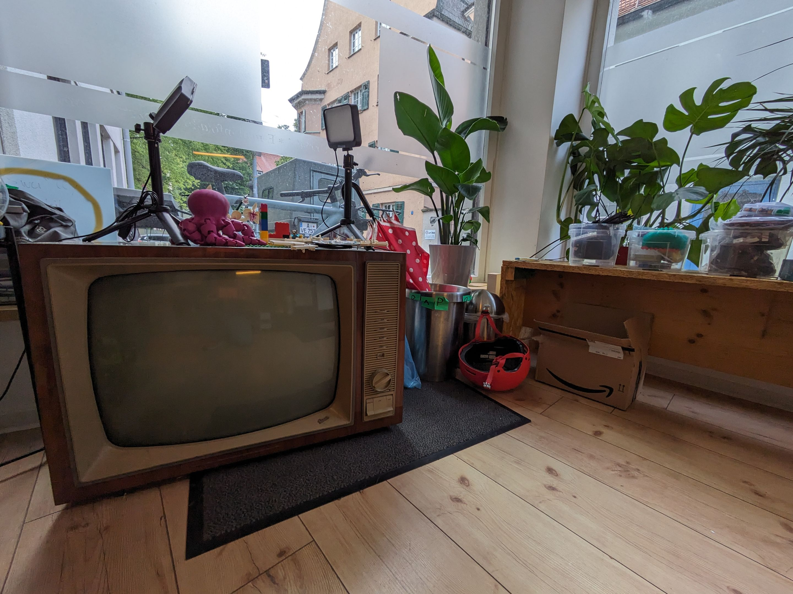
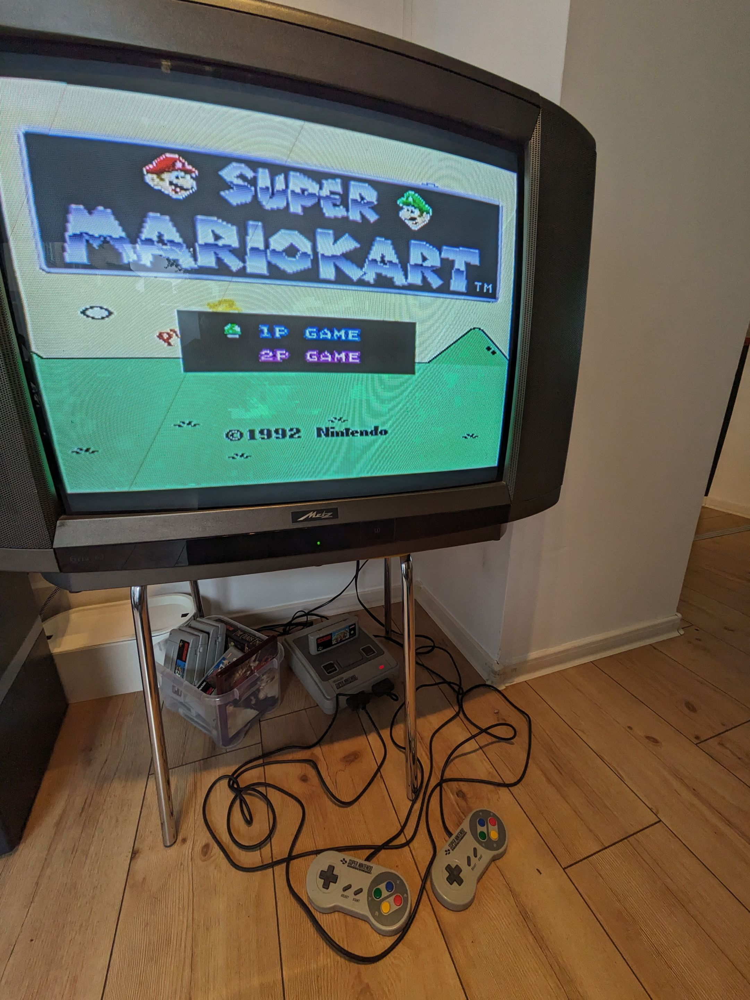
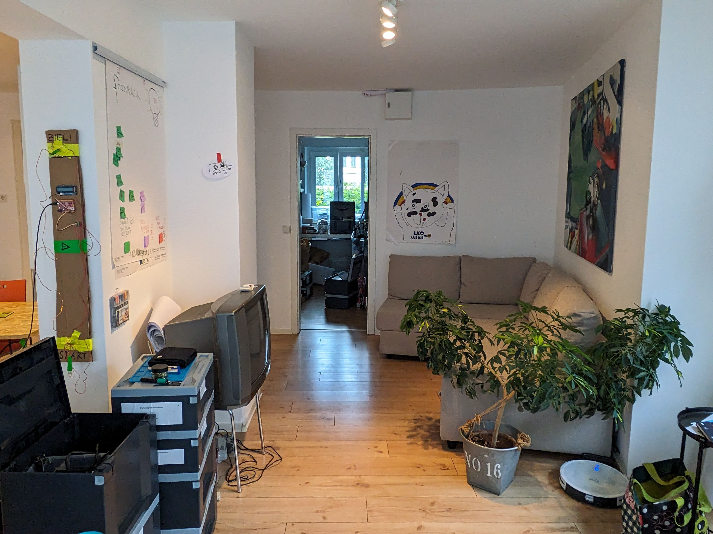
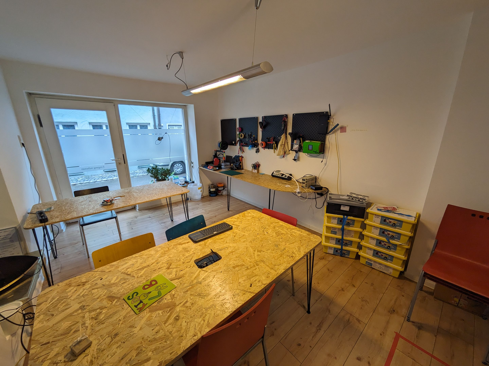


## Prices, course fees, and discounts

We calculate on a cost-covering basis without hidden fees or profit motives. As a <strong>nonprofit organisation</strong>, we deliberately forgo profits and operate strictly on a cost-recovery basis. <strong>Every euro flows directly back into our mission: giving children and teenagers the best possible support.</strong> This lets us offer high-quality programmes at affordable prices while making sure no child is excluded due to financial barriers.

Course fees and discounts

## Our partners


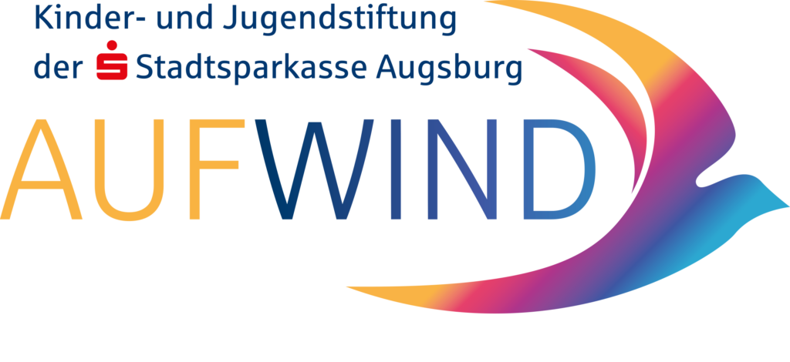
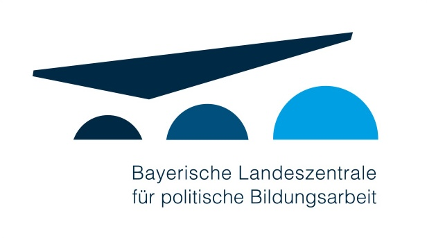

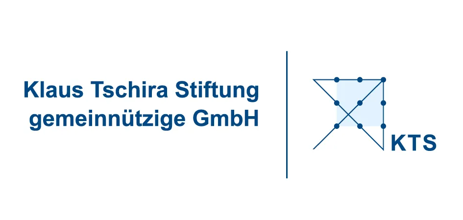



Our partners

## Want to help? Become a mentor!

Are you an expert in IT, media, programming, or similar, and enjoy helping children and teenagers grow beyond themselves? Then join our team! Get in touch with Gregor - gregor@kidslab.de

