> Das KidsLab — wer wir sind und was uns antreibt.

Das KidsLab ist eine gemeinnützige Organisation in Augsburg. Wir machen Maker Education für Kinder und Jugendliche: Programmieren, Basteln, Bauen, Experimentieren. Unser Ziel ist es, junge Menschen für Technik und Kreativität zu begeistern.

#### Unsere Vision & Misson

Das digitale Zeitalter ist längst Teil unseres Alltags geworden. Nicht erst seit der Corona-Pandemie spüren wir, wie wichtig digitale Bildung und die Stärkung digitaler Kompetenzen für unsere Kinder und Jugendlichen sind.

Aus diesem Grund haben wir, Regine Scheyer und Gregor Walter, die KidsLab gGmbH gegründet. Unsere gemeinnützige Organisation verfolgt ausschließlich wohltätige Zwecke. Unser Ziel ist es, die Bildung in den Bereichen Informatik und Medien zu fördern um Kinder und Jugendliche nachhaltig zu stärken und fit für die Zukunft zu machen.


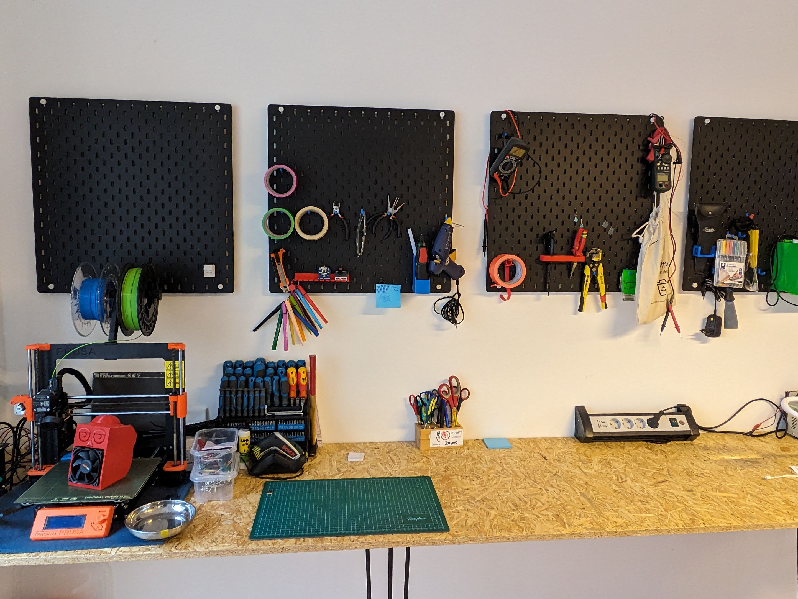
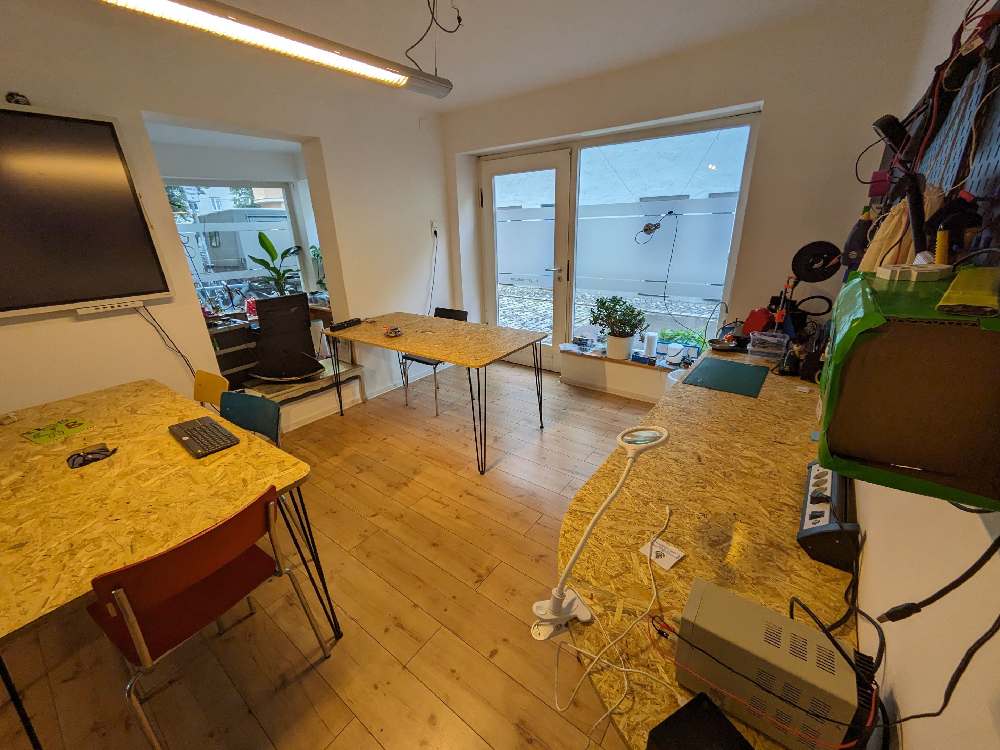
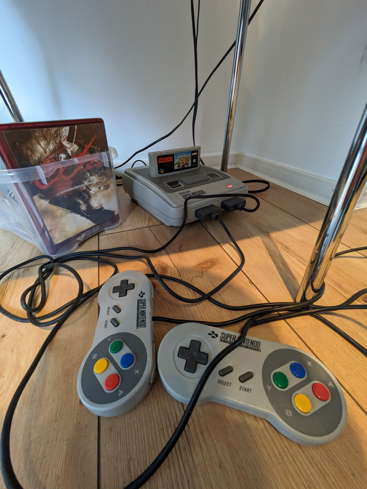
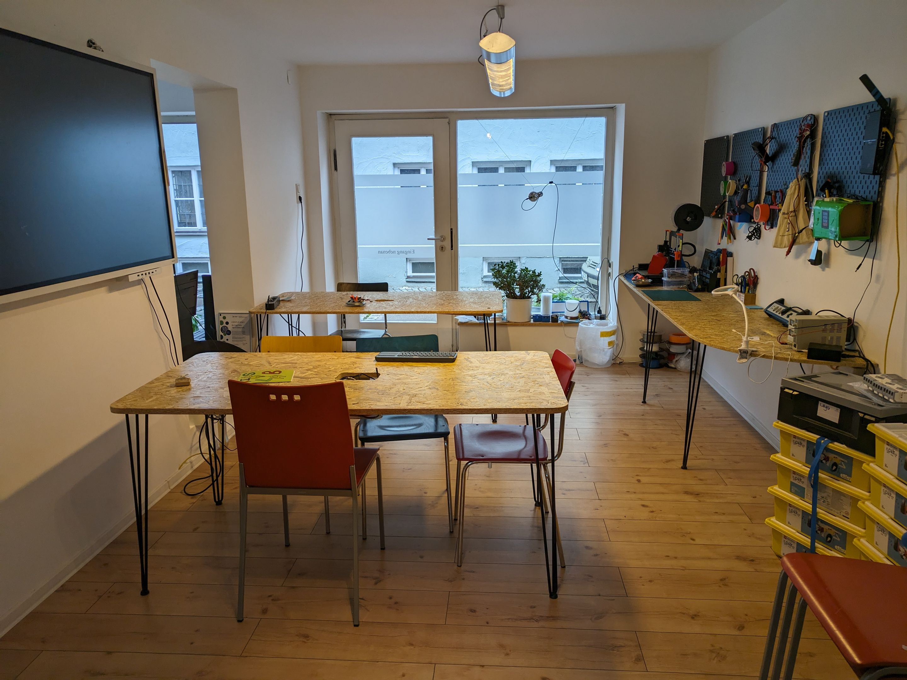
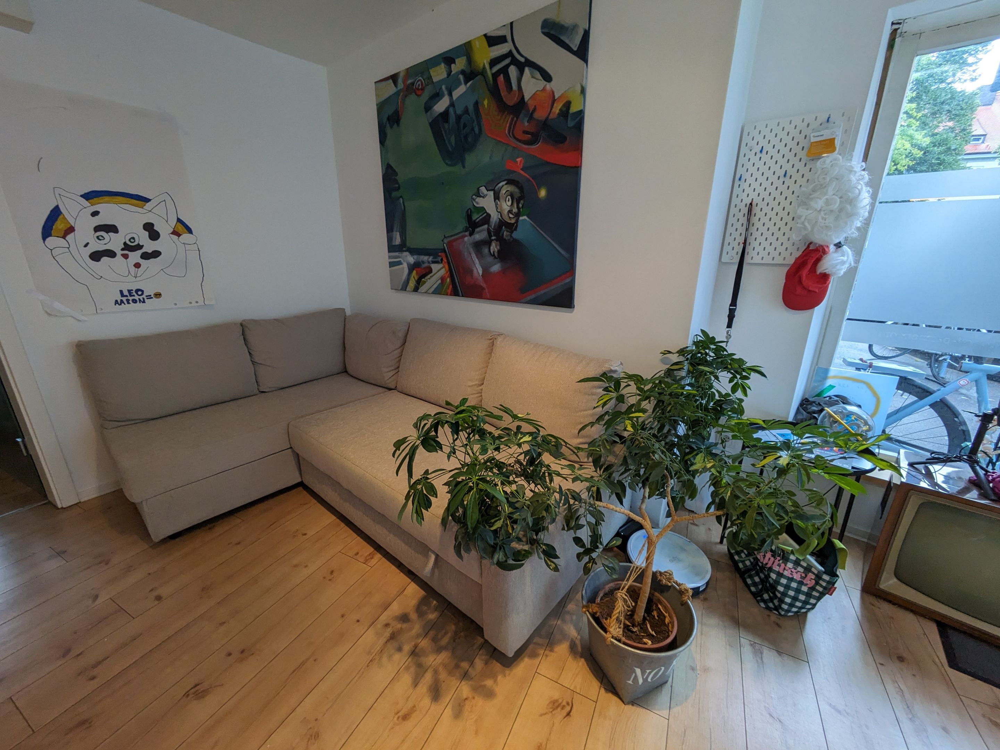
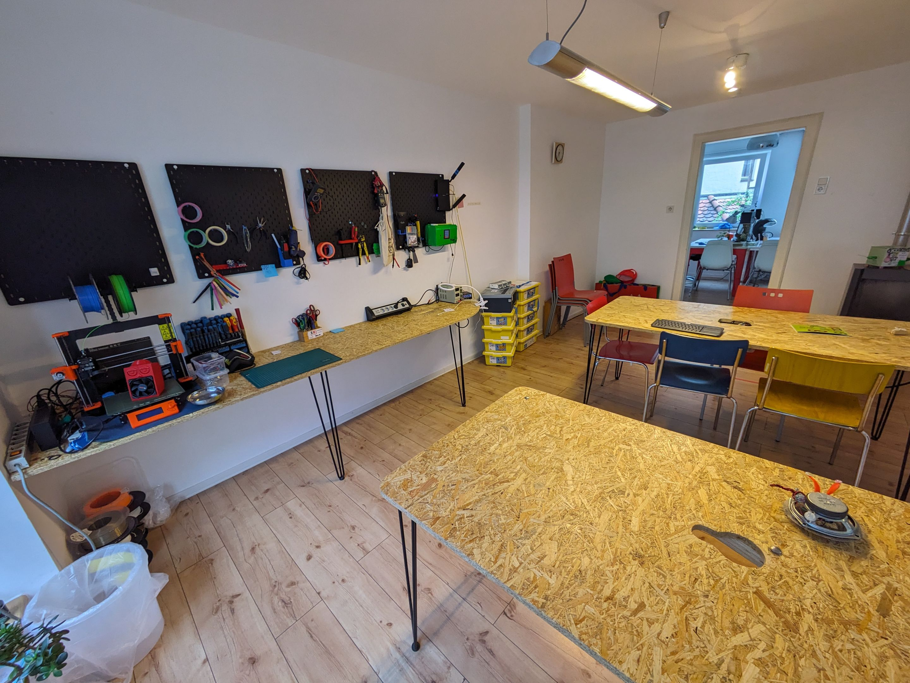
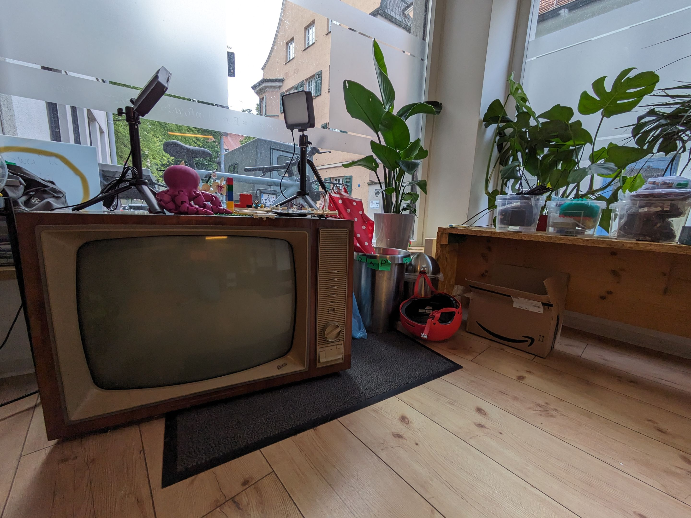
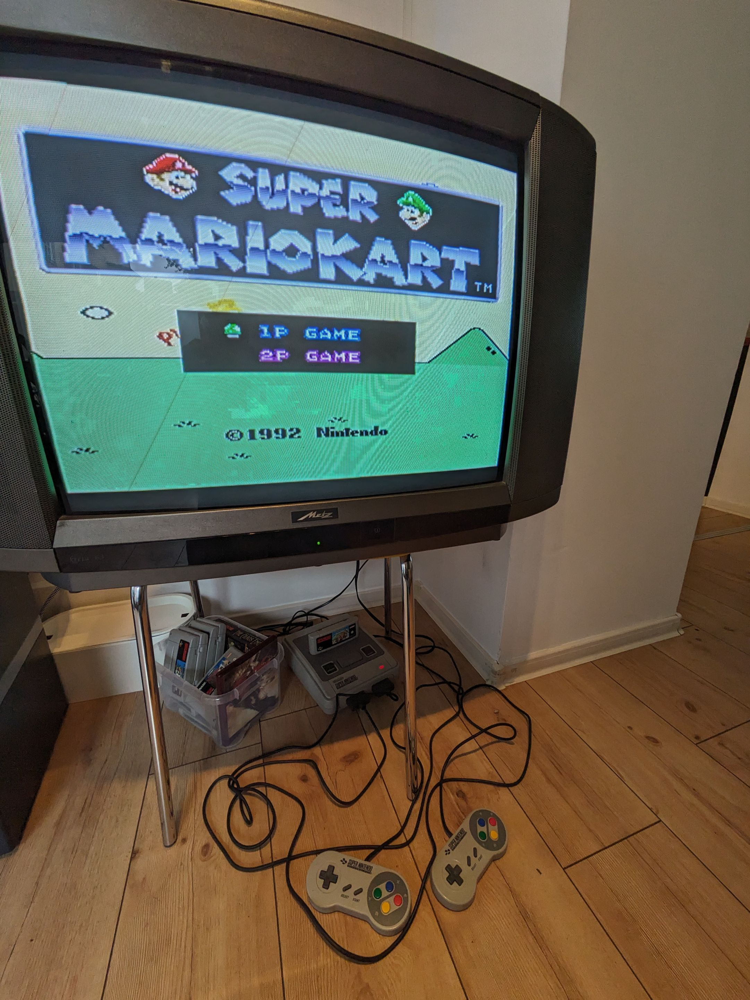
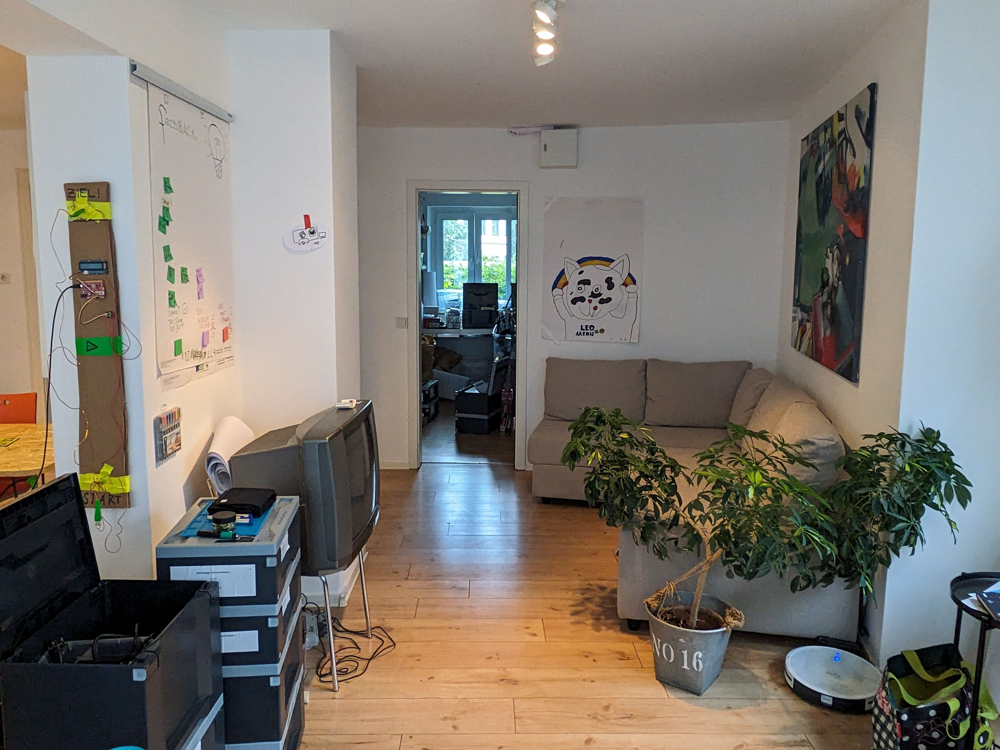
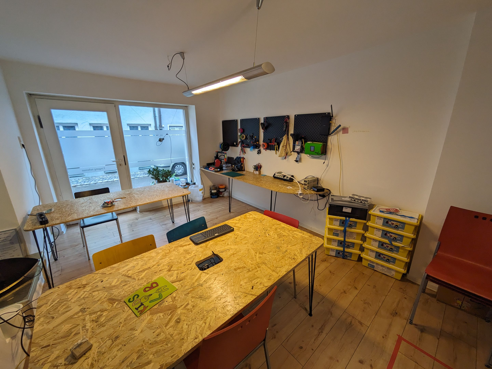


## Preise, Kursgebühren und Ermäßigungen

Wir kalkulieren kostendeckend und ohne versteckte Gebühren oder Gewinnabsichten. Als <strong>gemeinnützige Organisation</strong> verzichten wir bewusst auf Profite und orientieren uns ausschließlich am Kostendeckungsprinzip. <strong>Jeder Euro fließt direkt zurück in unsere Mission: die bestmögliche Förderung von Kindern und Jugendlichen.</strong> So können wir hochwertige Angebote zu erschwinglichen Preisen anbieten und gleichzeitig sicherstellen, dass kein Kind aufgrund finanzieller Hürden ausgeschlossen wird.

Kursgebühren und Ermäßigungen

## Unsere Partner


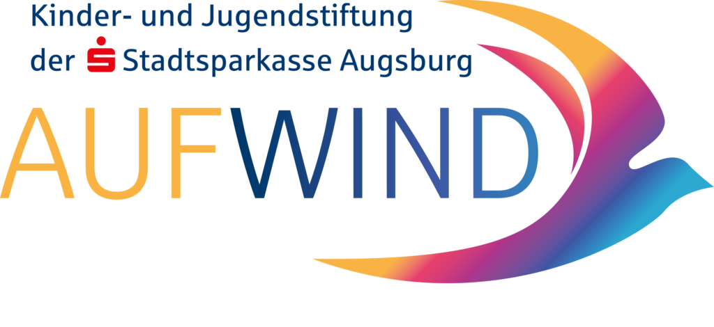

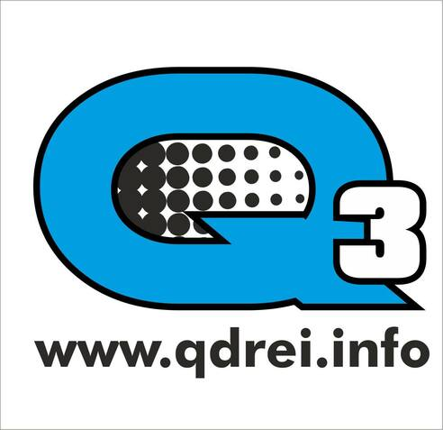

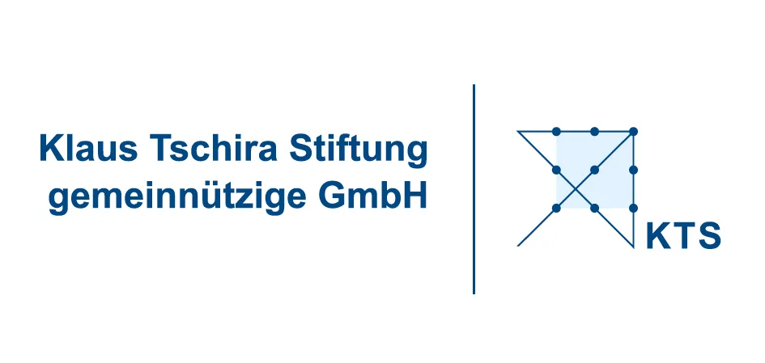



Unsere Partner

## Mitmachen? Werde Mentor!

Bist du Expert:in für IT, Medien, Programmierung etc. und hast Freude daran, Kinder und Jugendliche dabei zu unterstützen, über sich hinauszuwachsen? Dann werde Teil unseres Teams! Melde dich bei Gregor - gregor@kidslab.de

