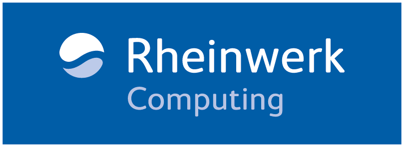
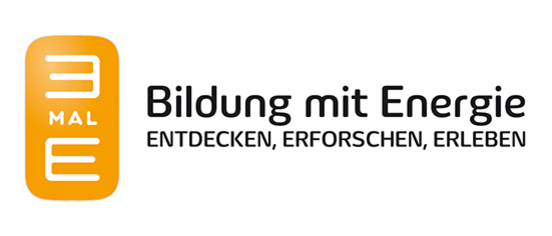
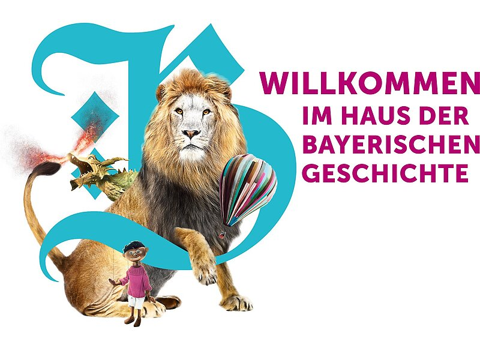
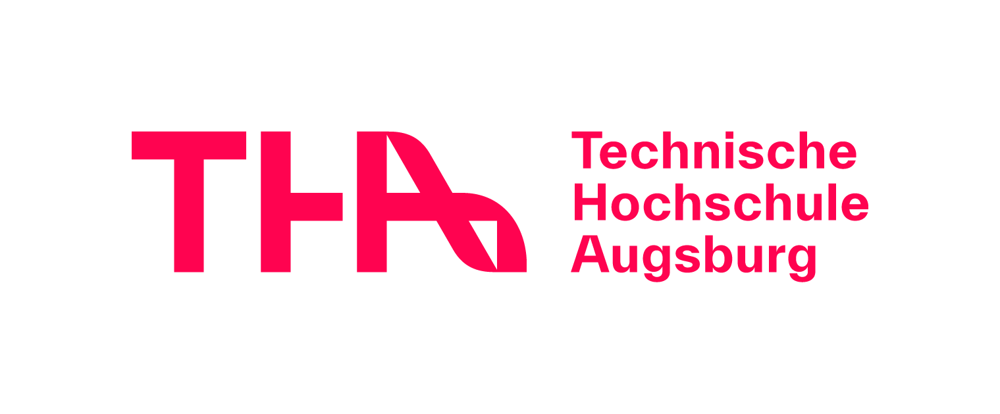
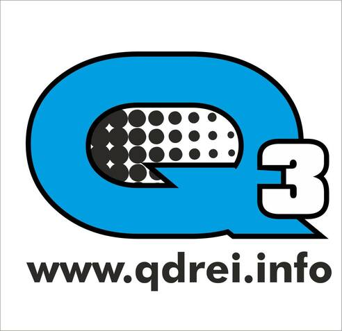
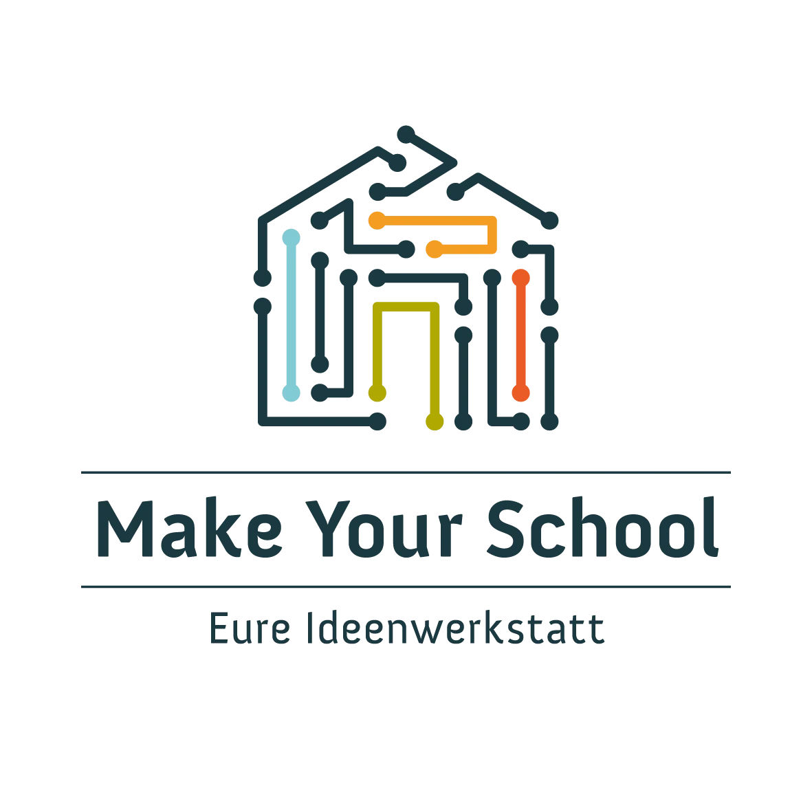
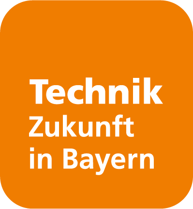

> Our partners and supporters — achieving more together.

## Our partners & supporters

KidsLab thrives on strong partnerships. Together with foundations, companies, public institutions, and cooperation partners, we create opportunities for children and teenagers. Thanks to this support, we can offer free workshops, run projects at schools, and develop innovative formats. Our partners make it possible for digital education to become accessible to everyone — regardless of background or budget.

## Foundations

<h3><a href="https://klaus-tschira-stiftung.de"><strong>Klaus Tschira Stiftung</strong></a></h3>
The physicist and SAP co-founder <strong>Klaus Tschira</strong> (1940–2015) founded the foundation in 1995 as a nonprofit company (gGmbH) based in Heidelberg. It funds natural sciences, mathematics, and computer science — focusing on research, education, and science communication. Its nationwide (German) engagement begins in kindergarten and continues through schools, universities, and research institutions. The foundation is committed to dialogue between science and society.

The <strong>Klaus Tschira Stiftung</strong> funds <a href="https://beta.kidslab.de/gameslab/">GamesLab</a>. Many thanks!

<h3><a href="https://www.sparkassenstiftungen.de/stiftungen/aufwind-kinder-und-jugendstiftung-der-stadtsparkasse-augsburg/stiftungs-startseite/"><strong>Aufwind – Children's and Youth Foundation of Stadtsparkasse Augsburg</strong></a></h3>
The <strong>AUFWIND</strong> foundation supports anyone who wants to make a difference with and for young people. Its goal is to improve the development opportunities and living conditions of children and teenagers in the Augsburg and Friedberg region.

Thank you for the support for the Augsburger <a href="https://beta.kidslab.de/gameslab/">GamesLab!</a>

## Federal, state & local government

<h3><a href="https://www.blz.bayern.de"><strong>Bavarian State Centre for Civic Education</strong></a></h3>
The <strong>Bavarian State Centre for Civic Education</strong> (Bayerische Landeszentrale für politische Bildungsarbeit) is one of the central institutions for civic education in the Free State of Bavaria. It offers a broad range of programmes on current and historical political topics. Through publications, events, and media formats, the State Centre informs citizens in Bavaria about politics and democracy and encourages political participation — all on a factual, non-partisan basis.

Commissioned by the <strong>Bavarian State Centre for Civic Education</strong>, we have been running the project <a href="/demokratie-in-minecraft/">Digital Future Nights – The Future is Yours!</a> for 3 years. Through the project, we've reached over 1,100 teenagers so far.

## Companies

<h3><a href="https://xitaso.com"><strong>XITASO</strong></a></h3>
As a digitalisation partner and expert in high-end software engineering, <strong>XITASO</strong> advises B2B clients, identifies digitalisation potential, optimises business processes, and creates digital strategies and solutions. The company is shaped by an agile mindset with proven expertise in Industry 4.0, the Internet of Things (IoT), data science, artificial intelligence, and augmented reality. Making complex systems simple and intuitive to use is at the heart of what they do.

Thank you for the support, which benefits all of our efforts!

<h3><a href="https://www.rheinwerk-verlag.de"><strong>Rheinwerk Computing</strong></a></h3>
<strong>Rheinwerk Verlag</strong> is Germany's leading publisher for digital topics such as programming, design, and photography. It's not just adults who find the right IT book there! There are numerous computer books for curious minds who want to playfully learn how a PC works, how to program their own game or robot, or how to become a Minecraft pro. This way, even the youngest kids get their start in the world of technology and IT!

Thank you for the various book donations!

<h3><a href="https://www.team23.de"><strong>Team 23</strong></a></h3>
<strong>Team 23</strong> supports its clients through their digital transformation. With innovative methods and fresh thinking, the experts at <strong>Team 23</strong> help their clients build sophisticated websites, software solutions, mobile apps, and e-commerce solutions.

<strong>Team23</strong> supports us financially and with hands-on help from their staff at <a href="https://beta.kidslab.de/gameslab/">GamesLab</a> – thank you!

<h3><a href="https://www.3male.de"><strong>3malE</strong></a></h3>
Under the motto "Discover, Explore, Experience," <strong>3malE</strong> aims to get young people and adults alike excited about future topics around energy and sustainability. Kids, students, educators, and parents will find numerous ways to enrich preschool education and classroom teaching with exciting elements — workshops, excursions, experiment kits, and other teaching and learning materials.

KidsLab takes part in the 3malE programme! Thank you for the many great workshops at schools made possible by <strong>3malE</strong>!

## Museums

<h3><a href="https://www.hdbg.de/basis/"><strong>House of Bavarian History</strong></a></h3>
Bavaria is legendary, the Free State a success story, its cultural landscape highly regarded. Bavaria has museums on the most diverse topics — but not, until now, on our most recent history, especially the history of democracy. The museum serves as the central repository of knowledge for that. At its centre are the people of Bavaria — all its native communities as well as those who came from far away and made it their home. The common thread of its permanent exhibition: how Bavaria became a Free State, and what makes it so special.

The <strong>House of Bavarian History</strong> commissioned us to program a themed game for the exhibition "<a href="https://www.museum.bayern/ausstellungen/sonderausstellungen/ois-anders-grossprojekte-in-bayern-1945-2020.html">OIS ANDERS: GROSSPROJEKTE IN BAYERN 1945–2020</a>" (Everything's Different: Major Projects in Bavaria 1945–2020). Thank you for the great collaboration.

## Cooperation partners

<h3><a href="https://www.tha.de"><strong>Augsburg University of Applied Sciences (THA)</strong></a></h3>
The <strong>Augsburg University of Applied Sciences</strong> (Technische Hochschule Augsburg) is one of the largest universities of applied sciences in Bavaria. It offers a broad range of degree programmes in engineering, business, design, and computer science, and is heavily engaged in regional education work.

THA supports us at <a href="/gameslab/">GamesLab</a> with workshops – in 2025 with AI workshops, and in both 2025 and 2026 with LEGO workshops. Thank you for the great collaboration!

<h3><a href="https://www.qdrei.info/">Q3. Quartier für Medien.Bildung.Abenteuer</a></h3>
Q3. Quartier für Medien.Bildung.Abenteuer is a nonprofit company active in media education.

Q3 collaborates with us on <a href="https://jugendhackt.org">JugendHackt</a>, <a href="/gameslab/">GamesLab</a>, and events around <a href="/demokratie-in-minecraft/">Democracy in Minecraft</a>.

<h3><a href="https://makeyourschool.de"><strong>Make Your School – Eure Ideenwerkstatt</strong></a></h3>
Hackdays run by <strong>Make Your School</strong> are extracurricular events that take place at schools across Germany. Over two to three days, students think about how to make their school better using digital and technical solutions. In teams, they work on turning their idea into reality. Schools receive materials for this (e.g. microcontrollers, tools, or sensor kits) and are supported in planning and running the hackdays by the project team.

We are the partner organisation of <strong>Make Your School</strong> for the Augsburg region. Thanks to this fantastic initiative, we're able to run a wide range of ideas workshops in our region.

<h3><a href="https://jugendhackt.org"><strong>Jugend hackt!</strong></a></h3>
At Jugend Hackt events and regular sessions in their labs, kids and teenagers get the chance to try out their technical skills, learn new ones, and exchange ideas about social issues.

<h3><a href="https://www.tezba.de/projekte/code-your-way/"><strong>CodeYourWay</strong></a></h3>
The education initiative <strong>Technik – Zukunft in Bayern</strong> has been getting kids and teenagers excited about technology for over 20 years with its projects. The <strong>code your way</strong> programme was launched by <strong>Technik – Zukunft in Bayern</strong> to spark teenagers' interest in coding and enable them to go deeper in a lasting way. A low barrier to entry, exciting tasks, interesting encounters, and plenty of room for hands-on exploration give teenagers the chance to discover the world of coding. Thanks to <strong>Technik – Zukunft in Bayern</strong>, KidsLab is able to run <strong>Code your way workshops</strong> at the advanced level.

