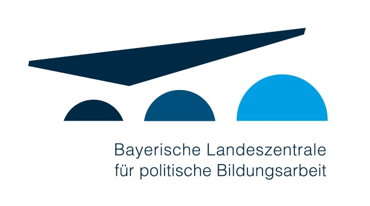
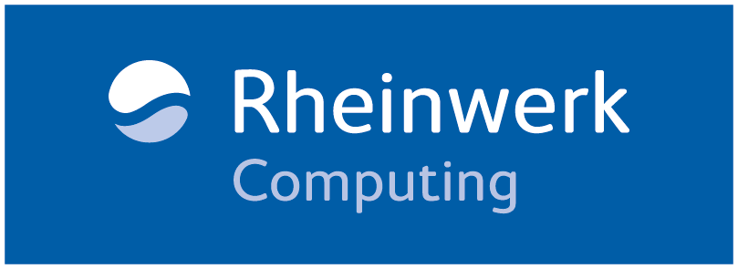
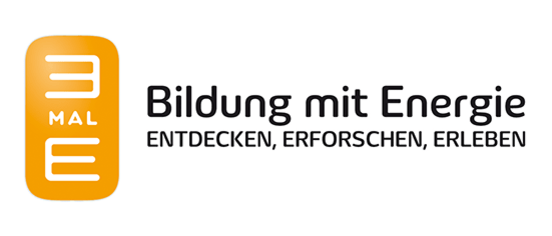
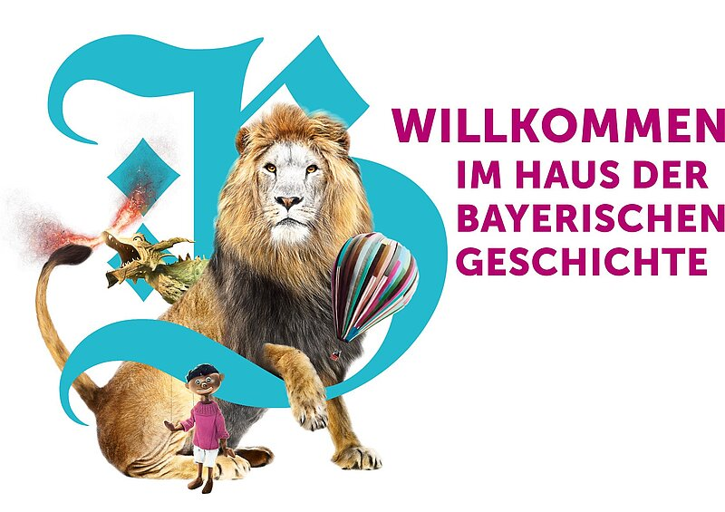
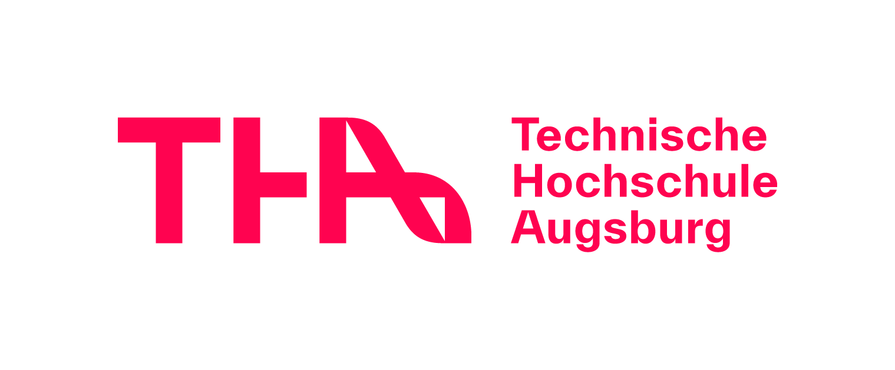
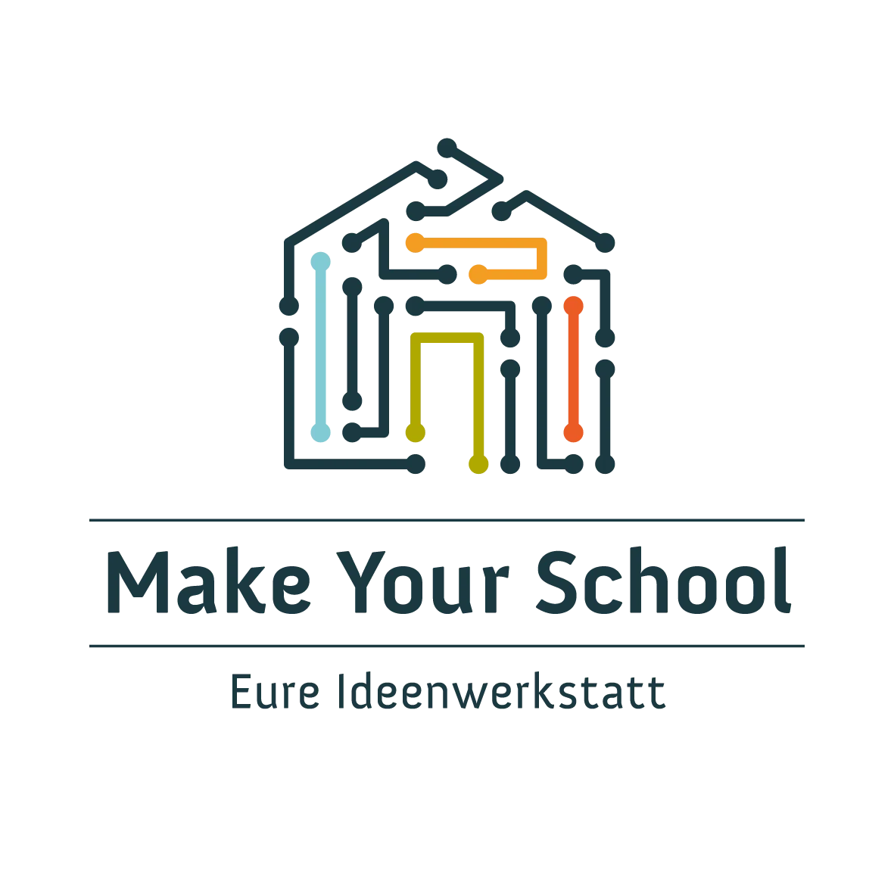
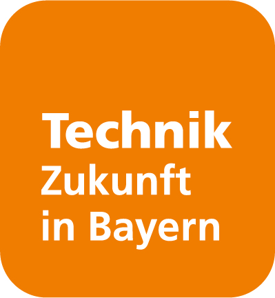

> Unsere Partner und Unterstützer — gemeinsam mehr erreichen.

## Unsere Partner & Unterstützer

KidsLab lebt von starken Partnerschaften. Gemeinsam mit Stiftungen, Unternehmen, öffentlichen Einrichtungen und Kooperationspartnern schaffen wir Chancen für Kinder und Jugendliche. Dank dieser Unterstützung können wir kostenlose Workshops anbieten, Projekte an Schulen umsetzen und innovative Formate entwickeln. Unsere Partner machen es möglich, dass digitale Bildung für alle zugänglich wird – unabhängig von Herkunft oder Budget.

## Stiftungen

<h3><a href="https://klaus-tschira-stiftung.de"><strong>Klaus Tschira Stiftung</strong></a></h3>
Der Physiker und SAP-Mitgründer <strong>Klaus Tschira</strong> (1940–2015) gründete die Stiftung 1995 als gemeinnützige GmbH mit Sitz in Heidelberg.Gefördert werden Naturwissenschaften, Mathematik und Informatik – mit den Schwerpunkten Forschung, Bildung und Wissenschaftskommunikation. Das bundesweite Engagement beginnt im Kindergarten und setzt sich in Schulen, Hochschulen und Forschungseinrichtungen fort. Die Stiftung setzt sich für den Dialog zwischen Wissenschaft und Gesellschaft ein.

Die <strong>Klaus Tschira Stiftung</strong> fördert das <a href="https://beta.kidslab.de/gameslab/">GamesLab</a>. Vielen herzlichen Dank!

<h3><a href="https://www.sparkassenstiftungen.de/stiftungen/aufwind-kinder-und-jugendstiftung-der-stadtsparkasse-augsburg/stiftungs-startseite/"><strong>Aufwind – Kinder- und Jugendstiftung der Stadtsparkasse Augsburg</strong></a></h3>
Die Stiftung <strong>AUFWIND</strong> unterstützt alle, die mit und für junge Menschen etwas bewegen wollen. Ziel ist es, die Entwicklungsmöglichkeiten und Lebensumstände von Kindern und Jugendlichen in der Region Augsburg und Friedberg zu verbessern.

Danke für die Unterstützung beim Augsburger <a href="https://beta.kidslab.de/gameslab/">GamesLab!</a>

## Bund, Länder & Kommunen

<h3><a href="https://www.blz.bayern.de"><strong>Bayerische Landeszentrale für politische Bildungsarbeit</strong></a></h3>
Die <strong>Bayerische Landeszentrale für politische Bildungsarbeit</strong> ist eine der zentralen Institutionen der politischen Bildung im Freistaat Bayern. Sie bietet ein breites Angebot zu aktuellen und historischen politischen Themen. Durch Veröffentlichungen, Veranstaltungen und mediale Formate informiert die Landeszentrale Bürgerinnen und Bürger in Bayern über Politik und Demokratie und regt zur politischen Teilhabe an. Dies alles geschieht auf sachlicher, überparteilicher Grundlage.

Im Auftrag der <strong>Bayerischen Landeszentrale für politische Bildungsarbeit</strong> setzten wir seit 3 Jahren das Projekt <a href="/demokratie-in-minecraft/">Digitale Zukunftsnächte – The Future is Yours! </a>um. Mit dem Projekt konnten wir bisher über 1100 Jugendliche erreichen.

## Unternehmen

<h3><a href="https://xitaso.com"><strong>XITASO</strong></a></h3>
Als Digitalisierungspartner und Experte für High-End Software Engineering steht <strong>XITASO</strong>  B2B-Kunden beratend zur Seite, identifiziert  Digitalisierungspotenziale, optimiert Geschäftsprozesse und erstellt  digitale Strategien und Lösungen. Das Unternehmen ist geprägt durch ein  agiles Mindset mit einer ausgewiesenen Expertise in den Bereichen  Industrie 4.0, Internet of Things (IoT), Data Science, Künstliche  Intelligenz und Augmented Reality. Komplexe Systeme in der Anwendung  einfach und intuitiv bedienbar zu machen, steht dabei im Mittelpunkt.

Vielen Dank für die Unterstützung, die all unseren Bemühungen zu Gute kommt!

<h3><a href="https://www.rheinwerk-verlag.de"><strong>Rheinwerk Computing</strong></a></h3>
Der <strong>Rheinwerk Verlag</strong> ist Deutschlands führender Fachverlag für digitale Themen wie Programmierung, Design und Fotografie. Dort finden nicht nur Erwachsene das passende IT-Buch! Es gibt zahlreiche Computerbücher für neugierige Köpfe, die spielerisch lernen möchten, wie ein PC funktioniert, wie sie ein eigenes Spiel oder einen Roboter programmieren, oder wie sie zum Minecraft-Profi werden. So steigen auch schon die Kleinsten in die Welt der Technik und IT ein!

Danke für die diversen Bücher-Spenden!

<h3><a href="https://www.team23.de"><strong>Team 23</strong></a></h3>
<strong>Team 23</strong> begleitet Ihre Kund:innen bei deren digitaler Transformation. Mit innovativen Methoden und neuen Denkansätzen helfen und unterstützen die Expert:innen von <strong>Team 23 </strong>ihre Kunden bei der Schaffung von anspruchsvollen Websites, Softwarelösungen, mobile Apps und E-Commerce Lösungen.

<strong>Team23 </strong>unterstützt uns finanziell und tatkräftige Unterstützung Ihrer Mitarbeitenden beim <a href="https://beta.kidslab.de/gameslab/">GamesLab</a> – vielen Dank!

<h3><a href="https://www.3male.de"><strong>3malE</strong></a></h3>
Unter dem Motto „Entdecken, Erforschen, Erleben" möchte <strong>3malE</strong> junge Menschen ebenso wie Erwachsene für Zukunftsthemen rund um Energie und Nachhaltigkeit begeistern. Kinder, Schüler:innen, Pädagog:innen und Eltern finden hier zahlreiche Möglichkeiten, die Vorschulbildung und den Unterricht mit spannenden Elementen in Form von Workshops, Exkursionen, Experimentiersets und weiterem Lehr- und Lernmaterial zu bereichern.

KidsLab nimmt am 3malE-Programm teil! Danke für die vielen tollen Workshops an Schulen, die <strong>3malE</strong> möglich gemacht hat!

## Museen

<h3><a href="https://www.hdbg.de/basis/"><strong>Haus der Bayerischen Geschichte</strong></a></h3>
Bayern ist legendär, der Freistaat ein Erfolgsmodell, seine Kulturlandschaft hoch geschätzt. Es gibt in Bayern Museen zu den vielfältigsten Themen, nicht jedoch zu unserer jüngsten Geschichte, insbesondere zur Demokratiegeschichte. Das Museum ist dafür der zentrale Wissensspeicher. Im Mittelpunkt stehen die Menschen in Bayern, alle Stämme und auch die Zugezogenen von weither, die ihre Heimat hier gefunden haben. Der rote Faden ihrer Dauerausstellung lautet: Wie Bayern Freistaat wurde und was ihn so besonders macht.

Das <strong>Haus der Bayerischen Geschichte</strong> hat uns für die Ausstellung „<a href="https://www.museum.bayern/ausstellungen/sonderausstellungen/ois-anders-grossprojekte-in-bayern-1945-2020.html">OIS ANDERS: GROSSPROJEKTE IN BAYERN 1945 – 2020″</a> beauftragt ein themenbezogenes Spiel zu programmieren. Danke für die tolle Zusammenarbeit.

## Kooperationspartner

<h3><a href="https://www.tha.de"><strong>Technische Hochschule Augsburg (THA)</strong></a></h3>
Die <strong>Technische Hochschule Augsburg</strong> ist eine der größten Hochschulen für angewandte Wissenschaften in Bayern. Sie bietet ein breites Spektrum an Studiengängen in Technik, Wirtschaft, Gestaltung und Informatik und engagiert sich stark in der regionalen Bildungsarbeit.

Die THA unterstützt uns im <a href="/gameslab/">GamesLab</a> mit Workshops – 2025 mit KI-Workshops und sowohl 2025 als auch 2026 mit LEGO-Workshops. Vielen Dank für die tolle Zusammenarbeit!

<h3><a href="https://www.qdrei.info/">Q3. Quartier für Medien.Bildung.Abenteuer</a></h3>
Q3. Quartier für Medien.Bildung.Abenteuer ist&nbsp;eine gemeinnützige GmbH, die in der Medienpraxis tätig ist.

Q3 arbeitet mit uns bei <a href="https://jugendhackt.org">JugendHackt</a>, <a href="/gameslab/">GamesLab</a> und den Veranstaltungen rund um <a href="/demokratie-in-minecraft/">Demokratie</a> zusammen.

<h3><a href="https://makeyourschool.de"><strong>Make Your School – Eure Ideenwerkstatt</strong></a></h3>
Hackdays von&nbsp;<strong>Make Your School</strong><em>&nbsp;</em>sind außercurriculare Veranstaltungen, die an Schulen deutschlandweit stattfinden. Zwei bis drei Tage überlegen sich Schüler*innen, wie sie ihre Schule mithilfe digitaler und technischer Lösungen noch besser machen können. In Teams tüfteln sie an der Umsetzung ihrer Idee. Dafür bekommen die Schulen Materialien (z.B. Mikrocontroller, Werkzeug oder Sensor Kits) zur Verfügung gestellt und werden in der Planung und Umsetzung der Hackdays durch das Projektteam unterstützt.

Wir sind die Partnerorganisation von <strong>Make Your School </strong>im Raum Augsburg. Dank dieser großartigen Initiative sind wir in der Lage, eine Vielzahl von Ideenwerkstätten in unserer Region umzusetzen.

<h3><a href="https://jugendhackt.org"><strong>Jugend hackt!</strong></a></h3>
Auf den Jugend Hackt Events und regelmäßigen Veranstaltungen in ihren Labs haben Kinder und Jugendliche die Möglichkeit, Ihre technischen Fähigkeiten auszuprobieren, neue zu erlernen und dich über gesellschaftliche Themen auszutauschen.

<h3><a href="https://www.tezba.de/projekte/code-your-way/"><strong>CodeYourWay</strong></a></h3>
Die Bildungsinitiative <strong>Technik – Zukunft in Bayern</strong> begeistert mit ihren Projekten seit über 20 Jahren Kinder und Jugendliche für Technik. Das Programm <strong>code your way</strong> wurde von <strong>Technik – Zukunft in Bayern</strong> ins Leben gerufen, um bei Jugendlichen das Interesse am Coden zu wecken und eine nachhaltige Vertiefung zu ermöglichen. Ein niederschwelliger Einstieg, spannende Aufgaben, interessante Begegnungen und viel Raum zum eigenen Ausprobieren geben den Jugendlichen die Möglichkeit, die Welt des Codings zu entdecken.&nbsp;

 Dank <strong>Technik – Zukunft in Bayern</strong> kann das KidsLab <strong>Code your way-Workshops</strong> im Level advanced durchführen.

